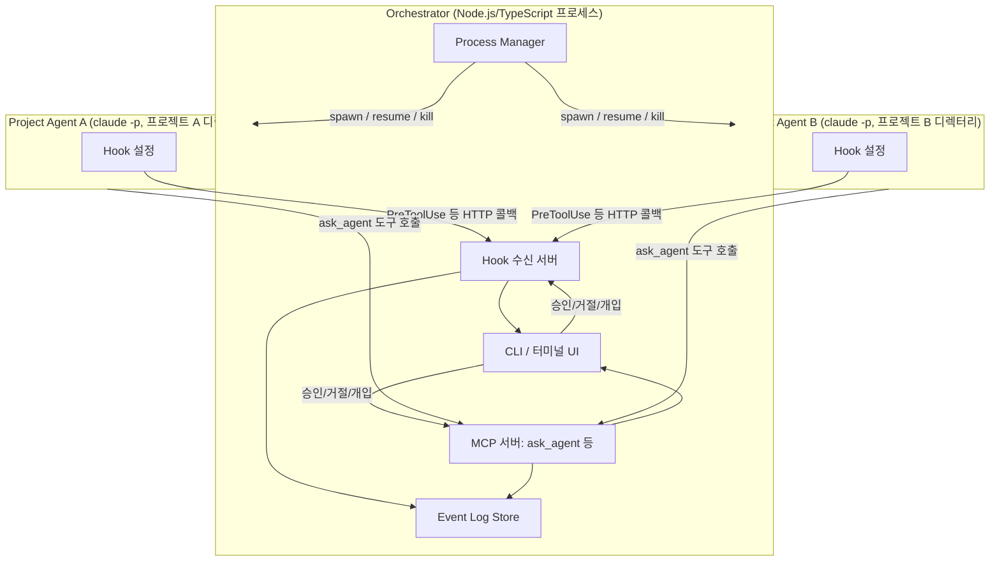
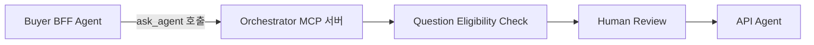

# 아키텍처 설계 (초안)

[mvp-scope.md](mvp-scope.md)에서 정의한 범위(2개 Project Agent + Orchestrator 중계 + Q&A 게이트 + Intervention + Event Log, CLI 인터페이스)를 실제로 어떻게 구현할지를 다룬다.

## 1. 기본 아이디어

Claude Code는 "여러 Claude Code 프로세스를 외부에서 감시·제어하는" 공식 기능을 제공하지 않는다. 대신 다음 세 가지 공식 기능을 조합해서 오케스트레이터를 구성한다.

| 기능 | 이 프로젝트에서의 역할 |
|---|---|
| 헤드리스 실행(`claude -p`) + `--resume` | Project Agent를 오케스트레이터의 자식 프로세스로 실행/재개 |
| Hook (`PreToolUse` 등) | 도구 호출 직전 오케스트레이터에게 "이거 해도 돼?"라고 물어보게 강제 → Event Log + 승인 게이트 + Intervention의 공통 진입점 |
| MCP 서버(커스텀 도구) | Agent 간 통신 수단을 오케스트레이터가 만든 도구 하나로 제한 |

Claude Code 자체의 내장 멀티에이전트 실험 기능(teammate 간 직접 메시징)은 §7 "Agent 간 직접 통신 금지" 원칙과 반대 방향이라 사용하지 않는다.

## 2. 구성 요소



- **Process Manager**: 프로젝트별로 `claude -p` 프로세스를 spawn/resume/kill한다. Agent마다 별도의 `CLAUDE_CONFIG_DIR`을 지정해 세션·설정 충돌을 막는다.
- **Hook 수신 서버**: 각 Agent의 hook이 보내는 이벤트(도구 호출 직전/직후 등)를 받는 로컬 HTTP 서버.
- **MCP 서버**: 각 Agent에게 주입되는 커스텀 도구(`ask_agent` 등)를 구현한다. 이게 Agent 간 통신의 유일한 통로다.
- **Event Log Store**: Hook과 MCP 서버를 거친 모든 이벤트를 시간순으로 쌓는다.
- **CLI**: Human이 로그를 보고 승인/거절/개입 명령을 입력하는 터미널 인터페이스.

## 3. Agent 간 통신 강제 (§7 대응)

각 Project Agent에게는 다른 프로젝트와 대화할 수 있는 방법이 `ask_agent`라는 도구 하나뿐이다. 이 도구는 오케스트레이터가 직접 구현해서 제공하기 때문에, 호출은 예외 없이 오케스트레이터를 거친다. Agent 코드나 프롬프트가 어떻게 되어 있든, 물리적으로 다른 통로가 없다.



## 4. 승인 게이트 (§8~11 대응)

`ask_agent` 호출은 MCP 서버가 직접 처리하므로, 오케스트레이터는 호출 시점에 응답을 바로 돌려주지 않고 Human이 승인할 때까지 보류할 수 있다.

1. Agent A가 `ask_agent(target, question)` 호출
2. 오케스트레이터가 Question Eligibility Check(§8) 수행 — 필요하면 Agent A에게 보완 요청
3. CLI에 승인 대기 항목으로 표시 → Human이 승인/거절
4. 승인되면 Agent B의 다음 턴에 질문 전달 (`--resume`으로 프롬프트 주입)
5. Agent B의 답변도 동일하게 Answer Eligibility Check(§10) → Human Review를 거쳐 Agent A에게 전달
6. 답변 상태(`ANSWERABLE` / `UNKNOWN` 등, §11)는 데이터 모델 설계 단계에서 스키마로 확정

### 4.1 실측 검증 (v2.1.238, macOS)

"오케스트레이터가 `ask_agent` 응답을 얼마나 오래 보류할 수 있는가"(§11 미해결 사항 3번)를 직접 실험했다. `zod`(v3) + `@modelcontextprotocol/sdk`로 임의 지연 후 응답하는 MCP 서버(`slow_echo` 도구)를 만들어 `--mcp-config`로 연결하고, 지연 시간을 늘려가며 `claude -p`가 응답을 기다리는지 확인했다.

| 지연 시간 | 결과 |
|---|---|
| 60초 | 정상 수신 (`echo after 60003ms`, 전체 소요 65초) |
| 300초(5분) | 정상 수신 (`echo after 300008ms`, 전체 소요 306초) — 타임아웃 없음 |

**결론 (§11 미해결 사항 3번 해소)**: 적어도 5분까지는 MCP 도구 호출 응답을 지연시켜도 세션이 끊기거나 에러가 나지 않았다. Human Review가 몇 분 정도 걸리는 건 문제가 되지 않는다고 판단해도 된다. 다만 5분보다 훨씬 긴 보류(예: 몇 시간)에 대해서는 아직 확인되지 않았으므로, 오케스트레이터 설계 시 "장시간 미승인 상태"는 별도의 안전장치(예: 일정 시간 후 알림, 혹은 임시로 요청을 큐에 저장하고 도구 호출 자체는 타임아웃 처리)를 고려하는 게 안전하다.

## 5. Human Intervention 구현 (§12 대응)

공식 문서 확인 결과, `claude -p` 헤드리스 프로세스에 **`SIGTERM`**을 보내면 다음이 명시적으로 보장된다.

- 프로세스가 exit code 143으로 종료된다.
- 진행 중이던 턴은 "미완료" 상태로 기록되고, 이후 `--resume <session_id>`로 재개하면 **그 미완료 턴을 이어서** 계속 진행한다.

이 동작은 도구 실행 도중에도 적용되므로, 당초 우려했던 "다음 도구 호출 직전까지만 개입 가능"이라는 한계가 상당 부분 해소된다. 이를 기준으로 Intervention을 다음과 같이 구현한다.

- **Pause**: Agent 프로세스에 `SIGTERM`을 보낸다. 오케스트레이터는 이후 자동으로 재개하지 않고 대기한다.
- **Resume**: `--resume <session_id>`로 프로세스를 다시 spawn한다 — `SIGTERM`이 남긴 미완료 턴을 이어서 계속한다.
- **Stop**: Pause와 동일하게 `SIGTERM`을 보내되, 이후 재개하지 않는다. (Pause와 Stop은 신호 자체는 같고 "나중에 resume하느냐"만 다르다.)
- **Direct Instruction**: `SIGTERM`으로 현재 턴을 중단시킨 뒤, `--resume` 시 새 지시를 프롬프트로 얹어서 전달한다. 완전한 실시간 끼어들기는 아니지만, 도구 호출 경계를 기다릴 필요 없이 즉시 개입할 수 있다.

> **왜 SIGINT가 아니라 SIGTERM인가**: 인터랙티브 모드의 Esc-Esc에 대응하는 `SIGINT`도 존재하지만, 공식 문서에는 "턴을 정상적으로 끝낸다"는 것 외에 정확한 종료 상태나 `--resume` 가능 여부가 명시되어 있지 않다. 반면 `SIGTERM`은 "미완료 턴 + `--resume`으로 이어서 진행"이 명시적으로 문서화되어 있어 이쪽을 채택한다.
>
> **주의**: 도구 호출 완료 시 발생하는 `Stop` hook은 사용자 인터럽트(`SIGINT`/`SIGTERM`)로 종료된 경우에는 실행되지 않는다고 문서에 명시되어 있다. 따라서 pause/stop 이벤트는 hook이 아니라 **오케스트레이터가 자신이 직접 자식 프로세스를 종료시켰다는 사실 자체**로 인지한다(프로세스를 spawn한 주체이므로 이 정보는 이미 갖고 있다). `SessionEnd` hook은 참고용으로만 활용한다.

### 5.1 실측 검증 (v2.1.238, macOS)

문서에 명시되지 않은 부분(§11의 미해결 사항 1번)을 로컬 환경에서 직접 실험으로 확인했다.

**실험 1: 도구 실행 도중 `SIGTERM` 전송**

`Bash` 도구로 5초 이상 걸리는 실제 작업(`dd if=/dev/urandom of=/dev/null bs=1m count=15000`)을 실행시킨 뒤, 그 도구 호출이 진행 중인 시점에 부모 프로세스로 `SIGTERM`을 보냈다.

- 부모 `claude -p` 프로세스: exit code `143` (문서와 일치)
- `dd` 자식 프로세스: `SIGTERM`과 함께 정리됨. 고아 프로세스로 남지 않음 (v2.1.214의 "SIGTERM 중 Bash 프로세스 트리가 고아로 남는 버그" 수정이 반영된 것으로 보임)
- 세션 트랜스크립트에는 중단된 도구 호출이 `"Exit code 137"`(=128+SIGKILL, 도구 실행에 사용된 하위 프로세스가 SIGKILL로 정리됨)을 반환한 `tool_result` 에러로 기록됨 — 즉 "미완료"라기보다는 "에러로 종료된 도구 호출"로 남는다.

**실험 2: `SIGTERM` 이후 `--resume`**

- **프롬프트 없이 재개** (`claude -p --resume <id>`, `claude -p "" --resume <id>`): 둘 다 실패.
  ```
  Error: No deferred tool marker found in the resumed session. Either the session
  was not deferred, the marker is stale (tool already ran), or it exceeds the
  tail-scan window. Provide a prompt to continue the conversation.
  ```
  이 "deferred tool marker" 메커니즘은 SIGTERM 중단과는 무관한 별개 기능(백그라운드/비동기 도구 지연 처리용)으로 보이며, 우리 시나리오에는 해당하지 않는다.
- **실제 프롬프트와 함께 재개** (`claude -p "계속 진행해줘" --resume <id>`): 정상 동작. Agent는 직전 도구 호출이 에러(위 Exit code 137)로 끝났다는 걸 트랜스크립트에서 인지하고 그에 맞게 반응함(예: 재승인을 요청하거나 상황을 설명).

**결론 (§11 미해결 사항 1번 해소)**: `SIGTERM`으로 중단한 세션은 **반드시 프롬프트와 함께 `--resume`해야 한다.** 프롬프트 없는 재개는 지원되지 않는다. 따라서 §5의 Pause/Resume/Direct Instruction 설계에서 "Resume"은 항상 최소한 "계속 진행해" 수준의 placeholder 프롬프트를 함께 보내야 하며, 오케스트레이터가 이를 기본값으로 준비해두어야 한다.

## 6. Event Log 파이프라인 (§13 대응)

각 Agent의 hook(`PreToolUse`, `PostToolUse`, `SessionStart`, `SessionEnd` 등)이 오케스트레이터의 Hook 수신 서버로 이벤트를 보낸다. MCP 서버를 거치는 질문/답변 이벤트도 같은 Event Log Store에 함께 쌓여, CLI에서 시간순으로 조회할 수 있다.

### 6.1 구현 및 실측 검증

- `src/hook-server.ts` — `POST /events?agentId=<id>`로 hook payload를 받아 SQLite `event_log` 테이블에 적재하는 최소 HTTP 서버. hook은 Agent의 도구 실행을 막고 기다리는 동기 호출이라, 응답을 최대한 빠르게(DB insert 하나) 돌려준다.
- `src/agent-settings.ts` — Agent별 `settings.json`을 생성해 hook이 `curl -X POST .../events?agentId=...`로 이 서버를 호출하게 한다.
- `src/event-log.ts` — `EventLogStore`. `qa-store.ts`도 이걸 공유해서 `QUESTION_CREATED`/`QUESTION_REVIEWED`/`ANSWER_CREATED`/`ANSWER_REVIEWED`를 같은 로그에 남긴다.

**Hook 설정 형식**: 공식 문서에 정확한 스키마가 명시돼 있지 않아 로컬 v2.1.238로 직접 실험해서 확인했다. `PreToolUse`/`PostToolUse`는 `[{ matcher: "*", hooks: [{ type: "command", command: "..." }] }]` 형태(matcher 필요), `SessionStart`/`SessionEnd`는 matcher 없이 `[{ hooks: [...] }]`로도 동작했다.

**실측 검증**(`src/manual-test-hooks.ts`, `claude -p`로 Bash 명령 1회 실행): `SESSION_START` → `TOOL_PRE` → `TOOL_POST` → `SESSION_END` 4개 이벤트가 전부 정확히 기록됨. Question/Answer 이벤트 4종(`QUESTION_CREATED`/`QUESTION_REVIEWED`/`ANSWER_CREATED`/`ANSWER_REVIEWED`)도 `qa-store`만 직접 호출해 확인됨.

Intervention(§12 Pause/Resume/Stop/Direct Instruction)에 대한 Event Log 기록은 §12.6에서 연결했다.

## 7. Agent 상태 매핑 (§14 대응)

Agent 상태(`ANALYZING`/`IMPLEMENTING`/`WAITING_APPROVAL` 등)는 오케스트레이터가 Hook/MCP 이벤트를 관찰하며 계산하는 파생 값이다. 예를 들어 `ask_agent` 호출 후 승인 대기 중이면 `WAITING_APPROVAL`, hook 응답을 보류 중이면 `PAUSED`로 표시한다. 정확한 상태 전이 규칙은 데이터 모델 설계 단계에서 확정한다.

## 8. 기술 스택: Node.js / TypeScript

- Claude Code 생태계(MCP SDK 등)가 JS/TS 중심이라 연동이 가장 매끄럽다.
- 자식 프로세스 관리(`child_process`), stdout 스트림(JSON Lines) 파싱, HTTP 서버(hook 수신 + MCP 서버) 모두 표준 라이브러리·성숙한 패키지로 충분히 처리 가능하다.
- Windows/macOS 양쪽에서 Node.js 런타임 자체의 이식성은 검증되어 있다.

## 9. 프로세스 격리

프로젝트 디렉터리(cwd)는 각 프로젝트의 실제 경로를 그대로 사용한다.

> **수정 (실측 반영)**: 애초에 "Agent마다 별도의 `CLAUDE_CONFIG_DIR`을 지정"하는 안을 세웠으나, 새로 만든 빈 디렉터리를 `CLAUDE_CONFIG_DIR`로 지정하면 인증 정보가 없어 `"Not logged in · Please run /login"`으로 즉시 실패하는 것이 실측으로 확인됐다. 세션/트랜스크립트 격리는 이미 `session_id` + cwd 조합으로 이루어지므로([architecture.md §6 조사 결과](#6-전체-시스템-개념-구조)와 무관하게 별도 확인됨), MVP에서는 `CLAUDE_CONFIG_DIR`을 지정하지 않고 기본값(보통 `~/.claude`, 인증 정보 포함)을 그대로 상속한다. 여러 Agent가 정말 서로 다른 인증·설정 프로필을 써야 하는 시점이 오면, 그때 인증 정보까지 미리 준비된 디렉터리를 만들어 지정한다.

## 10. Claude Code 버전 요구사항

이 문서의 설계는 로컬에서 확인된 `2.1.238` 기준 공식 문서로 조사했다. 다만 각 기능이 정확히 몇 버전부터 지원되는지는 공식 문서/CHANGELOG에 명시되어 있지 않아, 아래는 CHANGELOG의 버그 수정 기록 등에서 역산한 **추정치**임을 명확히 한다.

| 기능 | 확인 방법 | 결과 |
|---|---|---|
| `SIGTERM` 시 미완료 턴 기록 + `--resume`으로 이어서 진행 | headless.md에 동작 자체는 명시. 도입 버전은 불명시 | v2.1.214에서 "SIGTERM 중 Bash 프로세스 트리가 고아 프로세스로 남는 버그" 수정 기록 있음 → 기능 자체는 그 이전부터 존재했을 것으로 추정 |
| Hook 이벤트(`PreToolUse`/`PostToolUse`/`SessionStart`/`SessionEnd`/`Stop`/`StopFailure`/`UserPromptSubmit`) | hooks.md에 동작은 명시. 도입 버전은 불명시 | CHANGELOG가 v2.1.209부터만 접근 가능해 그 이전 도입 시점은 확인 불가 |
| 프로젝트 레벨 MCP 서버 설정(`--mcp-config`) | headless.md/cli-reference.md에 동작은 명시. 도입 버전은 불명시 | v2.1.210 전후로 관련 버그 수정 기록 다수 |
| 별도 Agent 세션 격리(`CLAUDE_CONFIG_DIR`, `CLAUDE_CODE_PROJECT_DIR_NAME`) | 공식 문서에 버전 명시 있음 | `CLAUDE_CODE_PROJECT_DIR_NAME`은 v2.1.234+ |

**권장 최소 버전**: `v2.1.234` (`CLAUDE_CODE_PROJECT_DIR_NAME` 지원이 명시적으로 확인되는 가장 이른 버전 기준). 이보다 낮은 버전에서 다른 기능들이 동작하지 않는다는 근거는 없지만, 확인된 바가 없으므로 개발/테스트는 이 버전 이상에서 진행하는 것을 권장한다.

이 표의 "도입 버전 불명시" 항목들은 정확한 버전이 필요할 경우 Anthropic에 `/feedback`으로 별도 문의가 필요하다.

## 11. 미해결 사항

- ~~`SIGTERM` 이후 `--resume` 시 새 프롬프트 없이 순수하게 미완료 턴만 이어가는 것이 가능한지~~ → §5.1 실측 검증에서 해소. 불가능하며, 항상 프롬프트가 필요하다.
- Answer 상태 enum, Agent 상태 enum의 정확한 스키마 — 데이터 모델 설계 단계에서 확정
- ~~`ask_agent` MCP 도구 호출에 대한 응답을 오케스트레이터가 얼마나 오래 보류할 수 있는지(타임아웃 존재 여부)~~ → §4.1 실측 검증에서 해소. 최소 5분까지는 타임아웃 없음. 그 이상 장시간 보류는 별도 안전장치 필요
- 위 기능들의 정확한 도입 버전 (공식 문서에 명시 없음, 필요시 Anthropic 문의)
- 일부 환경에서는 Bash 도구 호출이 즉시 실행되지 않고 자체 백그라운드 Task로 위임되어(`task_started`/`task_notification` 이벤트) 예상보다 훨씬 빨리 끝나는 것이 관찰됐다. 이게 특정 환경/플러그인 설정에 국한된 동작인지, 일반적인 Claude Code 동작인지 확인되지 않았다. 오케스트레이터가 "도구 실행 중 여부"를 판단할 때 이 가능성을 감안해야 할 수 있다.
- ~~도구 호출 없는 일반 텍스트 응답이 Event Log 어디에도 안 남는다.~~ → [§16](#16-도구-호출-없는-일반-텍스트-응답-로깅)에서 해소됨.

## 12. 구현 현황

`src/`에 MVP 구현이 진행 중이다.

- `src/types.ts` — [data-model.md](data-model.md) §2~4 기준 `AgentLifecycleState`/`AgentConfig`/`Question`/`Answer` 타입
- `src/process-manager.ts` — Agent 프로세스 spawn/pause/resume/stop 구현. 다음이 실제 실행으로 검증됨:
  - `start()` → 세션 시작 → 생성(텍스트 응답) 도중 `pause()`(`SIGTERM`) → `PAUSED` → `resume(prompt)` → 이어서 진행 → `COMPLETED`까지 전체 사이클 정상 동작
  - `claudeConfigDir`을 지정하지 않으면(§9) 정상 동작, 새 빈 디렉터리를 지정하면 인증 실패 재현됨
- `src/db.ts` / `src/qa-store.ts` — Question/Answer 저장소. §설계와 달리 "오케스트레이터가 유일한 writer"가 아니라, Agent마다 뜨는 MCP 서버 프로세스 여러 개가 같은 SQLite 파일을 공유하는 구조로 구현했다(아래 참고).
- `src/mcp-server.ts` — `ask_agent`/`answer_question` 도구를 제공하는 stdio MCP 서버. Human 결정 대기는 SQLite 폴링(1초 간격)으로 구현했다(§4.1에서 5분까지 무타임아웃이 확인된 걸 근거로 안전하다고 판단).
- `src/admin-cli.ts` — Human이 대기 중인 질문/답변을 보고 승인/거절하고, Event Log·Agent 상태를 조회하고, Agent에 개입(§12.6)하는 최소 CLI.
- `src/orchestrator.ts` — 승인된 Question/Answer를 대상 Agent에게 자동 전달하고(§12.4), Agent lifecycle을 `agent-store.ts`에 기록하고(§12.5), 개입 요청을 처리한다(§12.6).
- `src/event-log.ts` / `src/hook-server.ts` / `src/agent-settings.ts` — Event Log 파이프라인(§6.1).
- `src/agent-store.ts` — Agent 상태 저장 및 Activity Label 계산(§12.5).
- `src/intervention-store.ts` — Human Intervention 요청 큐(§12.6).

### 12.1 설계 변경: MCP 서버를 "여러 stdio 인스턴스 + 공유 SQLite"로 구현

원래 다이어그램은 MCP 서버를 오케스트레이터 프로세스 하나에 속한 컴포넌트로 그렸지만, Claude Code의 `--mcp-config`는 Agent(=Claude Code 프로세스)마다 별도의 stdio 자식 프로세스로 MCP 서버를 띄우는 것이 기본 방식이다. Agent A와 Agent B가 서로 다른 프로세스에서 뜬 MCP 서버를 통해 통신하려면 그 상태가 어딘가 공유되어야 하므로, 각 stdio MCP 서버 인스턴스가 [data-model.md §7](data-model.md#7-저장소-권장)에서 이미 권장했던 같은 SQLite 파일을 공유하도록 구현했다. 오케스트레이터라는 별도 상시 프로세스를 새로 띄우지 않고도 여러 Agent 간 통신이 성립한다.

### 12.2 실측 검증: `ask_agent`/`answer_question` 승인 게이트

실제 `claude -p` 세션(에이전트 역할극)으로 네 가지 경로를 모두 확인했다.

| 경로 | 결과 |
|---|---|
| `ask_agent` → Human 승인 | 정확한 `question_id`와 함께 승인 메시지 반환 |
| `ask_agent` → Human 거절(사유 포함) | 도구 호출이 그 사유 그대로 반환됨 — [data-model.md §3.2](data-model.md#32-상태-흐름-89-대응)에서 설계한 "별도 전달 단계 없이 즉시 반환" 그대로 동작 |
| `answer_question` → Human 승인 | `answer_id`와 함께 승인 메시지 반환, `contentStatus`(`ANSWERABLE` 등)도 정확히 저장됨 |
| `answer_question` → Human 거절 | 코드 리뷰로만 확인(승인 경로와 대칭적인 로직이라 별도 API 호출 검증은 생략) |

### 12.3 알려진 한계 (§12.4에서 해결됨)

- ~~**자동 전달 미구현**~~ → §12.4에서 해결.
- ~~**Agent 신원 자가 신고**~~ → [§17](#17-agent-신원-검증-123-해결)에서 해결.

## 12.4 `ProcessManager` ↔ `qa-store`/`mcp-server` 통합

`src/orchestrator.ts`가 이 둘을 잇는다. 폴링 루프(`tick()`, 기본 2초 간격)가 승인됐지만 아직 전달되지 않은 Question/Answer(`listUndeliveredApprovedQuestions`/`listUndeliveredApprovedAnswers`)를 찾아 대상 Agent의 `ProcessManager`를 `start()`(첫 세션이면) 또는 `resume()`(이미 세션이 있으면)한다.

**"지금 전달해도 되는가" 판단**: data-model.md §2.2의 `WAITING_APPROVAL`/`WAITING_AGENT`는 이번 구현에서 별도로 만들지 않았다. Agent가 `ask_agent`/`answer_question` 호출로 승인을 기다리는 동안에도 그 Claude 프로세스 자체는 stdio에서 도구 응답을 기다리며 계속 살아있으므로, `ProcessManager` 입장에서는 이미 `RUNNING`으로 정확히 관찰된다. 즉 "이 Agent에게 새 프롬프트를 지금 밀어넣어도 되는가"라는 질문에는 `RUNNING`(및 `STARTING`/`PAUSED`) 여부만으로 충분히 안전하게 답할 수 있었다 — `WAITING_APPROVAL`/`WAITING_AGENT`는 관찰 가능성(사람이 보기 좋은 라벨) 목적으로만 필요하고, 이번 통합의 정확성에는 영향이 없었다.

**실측 검증**: `src/manual-test-orchestrator.ts`로 전체 왕복을 실제 두 개의 `claude -p` 세션(agent 역할극)으로 검증했다. buyer-bff가 `ask_agent` 호출 → (Human 승인 시뮬레이션) → Orchestrator가 api-agent를 자동 `start()` → api-agent가 `answer_question` 호출(실제로 작업 디렉터리가 비어 있어 `INSUFFICIENT_CONTEXT`로 정직하게 답변 — requirements.md §11 원칙이 실제로 발동한 사례) → (Human 승인 시뮬레이션) → Orchestrator가 buyer-bff를 자동 `resume()` → buyer-bff가 답변을 반영한 최종 응답 생성. Human 개입은 승인 두 번뿐이었고, 나머지 전달은 전부 자동으로 이어졌다.

## 12.5 Agent 상태 CLI (§14 대응, mvp-scope.md 완료 기준 충족)

`admin-cli.ts`는 매번 새로 뜨는 짧은 프로세스라 `ProcessManager`의 인메모리 상태를 직접 볼 수 없다. 그래서 `Orchestrator.registerAgent()`가 등록 시점과 이후 모든 `lifecycle-change`마다 `src/agent-store.ts`(새 `agents` 테이블)에 상태를 기록해두고, `admin-cli list-agents`는 그걸 조회한다.

Activity Label(§2.3)은 저장하지 않고 조회 시점에 `computeActivityLabel()`이 Event Log에서 가장 최근 `TOOL_PRE`를 찾아 계산한다 — §1에서 정한 "원시 데이터와 파생 표시를 분리한다" 원칙을 여기서도 그대로 따른 것이다.

**실측 검증**: `manual-test-orchestrator.ts` 실행 도중 별도 `admin-cli list-agents` 호출로 실시간 상태를 확인했다 — `api-agent`가 질문을 막 전달받아 `STARTING`인 동안 `buyer-bff`는 이미 `COMPLETED`로 정확히 구분되어 표시됐고, 최종적으로 둘 다 `COMPLETED`로 수렴했다. (이 테스트는 hook 설정 없이 돌렸기 때문에 Activity Label은 비어 있었다 — `TOOL_PRE` 이벤트가 없으니 계산할 게 없는 게 정상이다. Activity Label 계산 자체는 `manual-test-hooks.ts`에서 이미 검증된 Event Log 데이터를 사용한다.)

## 12.6 Human Intervention의 Event Log 기록

Question/Answer 승인과 같은 패턴이다: `admin-cli`(`pause-agent`/`resume-agent`/`stop-agent`/`instruct-agent`)는 `src/intervention-store.ts`의 새 `interventions` 테이블에 "개입 요청"만 남기고, `Orchestrator.tick()`이 폴링하며 실제로 `pm.pause()`/`pm.resume()`/`pm.stop()`을 호출한 뒤 `INTERVENTION` Event Log를 남긴다.

**Direct Instruction은 별도 kind가 아니다**: requirements.md §12.2("SIGTERM으로 턴을 끊고 `--resume` 시 새 지시를 프롬프트로 얹어 전달")를 그대로 따라, `instruct-agent`는 `PAUSE` 요청 하나와 프롬프트가 있는 `RESUME` 요청 하나를 순서대로 큐에 넣는 것으로 구현했다. Agent가 이미 한가하면 `PAUSE`는 아무 효과 없이 지나가고 `RESUME`만 적용된다.

**버그와 수정**: 처음 구현에서는 Q&A 자동 전달용 `isDeliverable()`(PAUSED를 "바쁨"으로 취급 — 사람이 멈춰둔 Agent를 자동 전달로 방해하지 않기 위한 설계)을 RESUME 개입에도 그대로 재사용했다가, RESUME이 정작 필요한 PAUSED 상태에서 스스로 막혀 영원히 적용되지 않는 버그가 났다. `canApplyResume()`을 별도로 분리해(PAUSED를 "재개 가능"으로 취급) 해결했다 — 실행해서 막힌 걸 보고 나서야 발견한 문제였다.

**실측 검증**(`src/manual-test-intervention.ts`, 실제 `claude -p` 세션): 텍스트 생성 도중 `pause-agent`(실제 셸로 `admin-cli` 호출) → `PAUSED` → `resume-agent`(프롬프트 포함) → `RUNNING` → `COMPLETED`. 이어서 새 세션에서 생성 도중 `instruct-agent` → `PAUSE` 즉시 적용 → `RESUME`(새 지시) 적용 → `COMPLETED`. Event Log에 `INTERVENTION` 4건(`PAUSE`×2, `RESUME`×2)이 `prompt`/`requestedBy`까지 정확히 기록됨을 확인했다.

## 12.7 완료 기준 7개를 잇는 통합 테스트

`src/manual-test-mvp-e2e.ts`가 [mvp-scope.md](mvp-scope.md) 완료 기준 7개 전부를 하나의 실행으로 검증한다. 실제 `claude -p` 세션과 실제 `admin-cli` 셸 호출(승인/거절/pause/resume/stop/instruct 전부)로 구성했다.

**시나리오**:
1. **Phase 1** — api-agent 단독 세션에서 긴 텍스트 작성 도중 `pause-agent` → `PAUSED` → `resume-agent`(일반 재개) → `RUNNING` → `instruct-agent`(Direct Instruction, "그만 작성하고 짧게 답해") → 즉시 반영되어 `COMPLETED`. (기준 4, 5)
2. **Phase 2** — buyer-bff가 `ask_agent` 호출 → `decide-question approve` → Orchestrator가 api-agent에 자동 전달(이미 세션이 있어 `resume()`으로 전달됨 — Phase 1과 세션 재사용) → api-agent가 `INSUFFICIENT_CONTEXT`로 답변 → `decide-answer approve` → buyer-bff에 자동 전달. (기준 1, 2, 3) MCP 도구 호출 자체가 hook을 발동시키므로 Event Log도 이 과정에서 함께 채워진다.
3. **Phase 3** — `stop-agent`(이미 idle이라 새 `claude -p` 세션을 띄우지 않음). (기준 4 마무리)
4. 각 단계 사이 `admin-cli list-agents`로 실시간 상태 확인. (기준 7)
5. 마지막에 Event Log를 타입별로 집계. (기준 6)

**결과**: `SESSION_START`/`SESSION_END` 6개씩, `TOOL_PRE`/`TOOL_POST` 7개씩, `QUESTION_CREATED`/`QUESTION_REVIEWED`/`ANSWER_CREATED`/`ANSWER_REVIEWED` 각 1개, `INTERVENTION` 5개(PAUSE 2 + RESUME 2 + STOP 1) — 9종 이벤트 타입 전부 기록됨. `list-agents`는 매 단계 정확한 상태(`RUNNING`/`PAUSED`/`COMPLETED`/`STOPPED`)를 반영했다.

**후속 조사로 해소됨**: `TOOL_PRE`/`TOOL_POST`가 명시적으로 호출한 MCP 도구 수(전체 2회)보다 많은 7개씩 기록된 원인을, 남아있던 테스트 DB의 원본 `payload.tool_name`을 직접 조회해 확인했다. 각 `tool_use_id`가 `PreToolUse`/`PostToolUse`에 정확히 한 번씩만 나타나(중복 발동 아님, hook 배선에 버그 없음), 실제로 다음 도구들이 추가로 호출된 것이었다.

| Agent | 도구 | 이유 |
|---|---|---|
| buyer-bff | `ToolSearch` ×1 | `ask_agent`가 이 환경에서 "지연 로딩" 도구라 호출 전 스키마 조회가 필요함 — 환경 자체의 정상 동작 |
| buyer-bff | `mcp__orchestrator__ask_agent` ×1 | 우리가 시킴 |
| api-agent | `Bash` ×3 | 우리가 시키지 않았는데, "ProductResponse에 재고 필드가 있어?"에 답하려고 실제로 프로젝트 디렉터리를 뒤져봄(비어 있어 결국 `INSUFFICIENT_CONTEXT`로 답변) — Agent가 추측 대신 실제로 확인부터 하려 한 정상 동작 |
| api-agent | `ToolSearch` ×1 | `answer_question`도 지연 로딩 도구라 마찬가지 |
| api-agent | `mcp__orchestrator__answer_question` ×1 | 우리가 시킴 |

buyer-bff 2개 도구 × 2이벤트(PRE/POST) = 4, api-agent 5개 도구 × 2이벤트 = 10, 합계 14 = `TOOL_PRE` 7 + `TOOL_POST` 7로 정확히 일치. 우리 코드의 버그가 아니라는 게 확정됐다.

## 13. Phase 2: Scribe Agent와 Decision Record

requirements.md §15~20, [data-model.md §7](data-model.md#7-decision-record-phase-2) 참고. MVP 오케스트레이션 루프(Phase 1) 위에 "의사결정 기록" 레이어를 얹었다.

### 13.1 설계 요약

- **트리거는 자동, 범위는 좁게**: Question/Answer가 **사유(reason)를 동반한 거절** 상태가 되면 자동으로 트리거된다. Direct Instruction 등 다른 이벤트는 트리거로 삼지 않았다 — Agent 상태(§7)에서 이미 적용한 "기계적으로 신뢰 가능한 신호만 쓴다"는 원칙을 여기서도 따른 것이다.
- **초안 → Human 승인**: Scribe가 `submit_decision_record`를 호출하면 즉시 `DRAFT`로 저장될 뿐 확정되지 않는다. Question/Answer/Intervention과 동일하게 Human이 `admin-cli`로 최종 승인해야 한다.
- **Scribe의 권한을 프롬프트가 아니라 도구 목록으로 제한**: Scribe Agent용 `ProcessManager`에는 `allowedTools`로 `mcp__orchestrator__submit_decision_record` 단 하나만 준다. `Bash`/`Edit`/`Write`/`ask_agent` 등은 애초에 주어지지 않으므로 "Scribe가 코드를 고치거나 다른 Agent에게 지시하는" 시나리오 자체가 구조적으로 불가능하다 — requirements.md §19 "Scribe는 결정하지 않는다"를 프롬프트 지시가 아니라 권한으로 강제한 것이다.
- **Orchestrator가 Decision Context를 큐레이션**: requirements.md §20대로, Scribe가 Event Log 전체를 뒤져 스스로 인과관계를 추측하게 하지 않는다. `Orchestrator.buildQuestionDecisionPrompt()`/`buildAnswerDecisionPrompt()`가 거절된 Question/Answer의 원문·자체 근거·거절 사유·거절한 Human만 정확히 골라 프롬프트로 넘긴다.

### 13.2 버그와 수정: `isDeliverable()`의 잘못된 지름길

Scribe를 실제로 실행해보다가 재현된 버그다. `isDeliverable()`에 있던 "`sessionId === null`이면 무조건 배포 가능"이라는 지름길이, `start()` 직후 `STARTING` 상태에서 아직 `session_id`가 도착하기 전(비동기로 몇백 ms~1초 정도 걸림)에도 참을 반환해버렸다. Question/Answer 전달 경로에서는 상태가 즉시 바뀌어(`markQuestionDelivered` 등) 같은 트리거가 다음 tick에 재조회되지 않아 이 버그가 드러나지 않았지만, Decision Record 트리거는 Scribe가 실제로 `submit_decision_record`를 호출할 때까지(초 단위로 걸림) 같은 거절 건이 계속 "아직 기록 안 됨"으로 재조회되는 구조라, 두 번째 tick에서 이미 `STARTING` 중인 Scribe에게 또 `start()`를 호출해 `"Agent scribe-agent already has a running process"` 에러로 즉시 드러났다.

원인을 보면 애초에 이 지름길은 불필요했다: `ProcessManager`의 초기 `lifecycleState`가 이미 `"STOPPED"`(busy 상태 목록에 없음)라서, 한 번도 시작 안 한 Agent도 `lifecycleState`만으로 정확히 "배포 가능"으로 판별된다. 지름길을 제거하고 `lifecycleState` 하나만 보도록 고쳤다(`canApplyResume()`도 동일하게 정리).

### 13.3 실측 검증

`src/manual-test-scribe.ts`로 실제 `claude -p` 세션 두 개(buyer-bff, scribe-agent)로 전체 흐름을 확인했다.

1. buyer-bff가 `ask_agent`로 질문
2. `admin-cli decide-question reject "이미 API 스펙 문서 v2에 재고 필드가 명시돼 있음..."`
3. Orchestrator가 다음 tick에서 자동으로 scribe-agent를 `start()` — Human이 따로 깨울 필요 없음
4. scribe-agent가 `submit_decision_record`를 정확히 한 번 호출, requirements.md §17의 9개 필드(배경/문제/제약사항/선택지/선택지 비교/판단 근거/결론/결정 주체/관련 정보)를 전부 채운 자연스러운 글로 작성 — 특히 "선택지 비교"에서 "이미 문서화된 정보를 다시 확인하는 절차가 중복된다"처럼, 주어진 사실을 넘어서는 창작 없이 딱 거절 사유에 근거한 서술만 냈다
5. `admin-cli list-decisions` / `show-decision`으로 초안 확인 → `admin-cli decide-decision approve` → `APPROVED`로 확정

`src/manual-test-scribe-answer.ts`로 나머지 하나(`ANSWER_REJECTED`) 경로도 별도로 확인했다: buyer-bff 질문 승인 → api-agent 답변 → `admin-cli decide-answer reject "..."` → scribe-agent 자동 기상 → 초안(`triggerType: ANSWER_REJECTED`, `triggerAnswerId`가 정확히 매칭) → 승인. 두 트리거 모두 실제 세션으로 확인 완료.

### 13.4 알려진 이슈: 테스트 스크립트가 자연 종료되지 않음 (원인 미확정)

`manual-test-scribe-answer.ts`를 실행했을 때 로직이 전부 끝나고 `clearInterval(pollTimer)`까지 지난 뒤에도 Node 프로세스가 스스로 종료되지 않는 현상이 두 번 재현됐다(280초 타임아웃까지 걸림). 조사한 내용과 조사하다가 멈춘 지점을 기록해둔다.

- **`ProcessManager`/`Orchestrator` 자체는 결백**: API 호출 없이 각각 단독으로 최소 재현을 시도했을 때 — Agent 하나만 실행해 세션을 끝내거나, `Orchestrator`를 만들고 `startPolling()` 후 바로 `clearInterval()`만 호출하거나 — 두 경우 모두 활성 핸들 0개로 깨끗하게 자연 종료됐다. 즉 이 두 컴포넌트 단독으로는 구조적 누수가 없다.
- **실패하는 시나리오에서 핸들을 직접 찍어보니**: `clearInterval` 직후 `process._getActiveHandles()`에 `ChildProcess` 1개(+연결된 `Socket` 3개)가 남아있었다. 정체는 Orchestrator가 api-agent에게 질문을 전달할 때 spawn한 그 `claude -p` 프로세스였고, `exitCode: null`, `killed: false`였다.
- **모순점**: 콘솔에는 이미 `[api-agent] lifecycle -> COMPLETED`가 찍혀 있었다. `ProcessManager`가 `COMPLETED`로 판정하는 유일한 경로는 Node의 `child.on("close", ...)` 콜백인데, 덤프된 객체 안의 Node 내부 카운터(`_closesNeeded: 3, _closesGot: 0`)를 보면 이 객체 기준으로는 아직 `close` 이벤트가 발생하지 않은 것으로 보였다. 콘솔 로그와 핸들 스냅샷이 서로 다른 이야기를 하고 있는 셈이라, 정확한 인과관계를 확정하지 못했다.
- **좀비 프로세스는 아니다**: 스크립트가 타임아웃으로 죽은 뒤 `ps aux`로 확인했을 때 관련 프로세스가 전혀 남아있지 않았다 — 결국엔(타임아웃이 강제로 죽이든, 스스로 정리되든) 정리된다.
- **멈춘 지점**: 여기서 더 정확한 원인을 알려면 프로세스가 아직 살아있는 도중에 `lsof`/`strace`로 실시간으로 들여다봐야 하는데, 지금까지 이 조사 하나에 실제 `claude -p` 세션을 4번 소비한 상태라 비용 대비 확신을 더 올리기 어렵다고 판단해 멈췄다.
- **지금 조치**: `manual-test-scribe.ts`/`manual-test-scribe-answer.ts` 둘 다 로직이 끝나면 `process.exit(0)`을 명시적으로 호출하도록 고쳐서, 이 현상과 무관하게 테스트가 항상 깔끔하게 끝나게 했다. 검증하려던 실제 내용(Decision Record 생성·승인)은 이 현상과 무관하게 두 트리거 모두 이미 확인이 끝난 상태다.
- **다시 볼 조건**: Phase 3 이후 Orchestrator를 실제로 오래 띄워두는 상황이 되면(지금은 매번 스크립트를 새로 실행하는 방식이라 노출이 잘 안 됨), 정말 미세한 누수가 쌓이는지 다시 살펴볼 가치가 있다.

## 14. 인터랙티브 데모 (`src/run-demo.ts`)

지금까지의 `manual-test-*.ts`는 전부 Human의 승인/거절/개입까지 스크립트가 대신 수행했다. `run-demo.ts`(`npm run demo`)는 처음으로 사람이 직접 손으로 조작해보는 진입점이다: Orchestrator + 3개 Agent(buyer-bff/api-agent/scribe-agent)를 띄워두고 계속 polling만 하며, 다른 터미널에서 `admin-cli`를 직접 입력해 개입하게 한다. DB는 `admin-cli`의 기본 경로(`.orchestrator/data.db`)를 그대로 써서 두 번째 터미널이 별도 설정 없이 같은 상태를 보게 했다. 사용법은 [testing-guide.md](testing-guide.md) 참고.

### 14.1 실사용 중 발견한 버그 두 가지

사람이 직접 처음 실행해보자마자 buyer-bff가 `STARTING` → `FAILED`로 즉시 실패했다.

- **원인이 안 보였던 문제**: `ProcessManager`가 자식 프로세스의 stderr를 아예 읽지 않고 있었다. `claude` CLI가 어떤 이유로 실패하든(잘못된 인자, 인증 문제 등) 아무 단서도 안 남았다. `child.stderr`를 Agent id를 붙여 그대로 우리 stderr로 흘려보내도록 고쳤다.
- **진짜 원인**: stderr를 살리자 `MCP config file not found`가 바로 보였다. `run-demo.ts`가 `--mcp-config` 경로를 `.orchestrator/mcp-config.json`처럼 **상대 경로**로 넘겼는데, `claude` CLI는 이 경로를 자기 자신의 cwd 기준으로 해석한다. `ProcessManager`가 Agent마다 `cwd`를 각자의 프로젝트 디렉터리로 바꿔서 실행하므로, 상대 경로가 엉뚱한 곳(Agent의 임시 작업 디렉터리)을 가리켜 파일을 못 찾은 것이었다. 다른 스크립트들은 전부 절대 경로를 써서 문제가 없었는데 이 스크립트만 상대 경로를 썼다. `resolve()`로 고쳤다.

두 수정 모두 실제로 다시 실행해서 에러가 사라지고 프로세스가 정상 spawn되는 것까지 확인했다. 다만 그 뒤 질문이 실제로 생성되는 단계는 그날 세션의 API 사용량 제한으로 완전히 끝까지 확인하지 못했다 — 코드 문제가 아니라 사용량 문제로 판단.

### 14.2 해결됨: `run.ts` + `orchestrator.config.json`

`run-demo.ts`는 각 Agent의 `projectPath`를 `mkdtempSync`로 만든 빈 임시 디렉터리로 하드코딩했다 — 그래서 지금까지의 모든 시연에서 api-agent가 항상 "작업 디렉터리가 비어 있다"며 `INSUFFICIENT_CONTEXT`로 답했다. `src/run.ts`(`npm run start`)를 새로 만들어 해결했다.

- **설정 파일**: 저장소 루트의 `orchestrator.config.json`(gitignore됨, 실제 로컬 경로가 들어가므로)에 `{ agents: [{ id, projectPath }], hookPort }`를 적는다. 템플릿은 `orchestrator.config.example.json`. zod로 스키마를 검증하고, 각 `projectPath`가 실제로 존재하는지도 시작 시점에 확인해서, 잘못된 설정이면 Agent를 하나도 안 띄우고 바로 에러 메시지와 함께 종료한다(§14.1에서 배운 "에러가 안 보이면 원인을 못 찾는다"는 교훈을 반영).
- **역할 고정 해제**: `run-demo.ts`는 buyer-bff=질문만/api-agent=답변만으로 역할을 고정했지만, 실제 프로젝트들은 서로 어느 방향으로든 묻고 답할 수 있어야 하므로 `run.ts`가 등록하는 모든 Project Agent는 `ask_agent`/`answer_question`을 둘 다 받는다. Scribe만 여전히 `submit_decision_record` 하나로 제한된다.
- **자동 시작 없음**: `run-demo.ts`와 달리 첫 프롬프트를 자동으로 보내지 않는다 — 실제 프로젝트마다 첫 작업 내용이 다르므로, Human이 `admin-cli resume-agent <id> "..."`로 직접 지시한다. `Orchestrator.processInterventions()`의 RESUME 처리가 이미 `sessionId === null`이면 `start()`로 대신 처리하므로(§12.4~12.6 참고), 이 용도에 별도 admin-cli 명령을 새로 만들 필요가 없었다.

### 14.3 실측 검증 (부분적 → §14.4에서 해결됨)

설정 검증·경로 해석·`claude` 프로세스 spawn까지는 실제로 확인했다: 진짜 파일이 든 임시 디렉터리 두 개(예: `ProductResponse.java`에 `stockQuantity` 필드가 실제로 있는 파일)를 만들어 `orchestrator.config.json`으로 등록하고 `npm run start`로 띄운 뒤, `admin-cli resume-agent buyer-bff "..."`로 첫 지시를 내렸다. 프로세스 인자를 확인하니 `--mcp-config`/`--settings` 둘 다 정확한 절대 경로로 들어가 있었고(§14.1의 버그가 재발하지 않음), Agent도 정상적으로 `RUNNING`까지 도달했다.

다만 "api-agent가 실제로 그 파일을 읽고 `stockQuantity` 필드를 찾아서 답하는지"까지의 전체 왕복은 두 번 시도했으나 둘 다 확인하지 못했다 — buyer-bff의 첫 `ask_agent` 호출 자체가 매번 2분 넘게 응답이 안 왔다(CPU 시간도 거의 안 늘어남, API 응답 대기 중인 패턴). 처음엔 사용량 제한으로 추정했지만, 두 번째 시도 때는 같은 세션에서 `claude -p "hi"`가 몇 초 안에 정상 응답했고 `lsof`로 확인한 네트워크 연결도 Anthropic API 서버에 정상적으로 맺혀 있어서, 순수 레이트리밋이라고 단정하긴 어렵다 — 도구 호출이 낀 세션에서만 반복적으로 느려지는 원인 불명의 지연으로 정리한다. 코드나 설정에 문제가 있다고 볼 근거는 없었다(인자 전부 정확, 프로세스 정상 spawn, 네트워크 연결도 정상). [backlog.md](backlog.md)에 "부분 검증" 상태로 남겨뒀다.

### 14.4 해결됨: `ORCHESTRATOR_DB_PATH` 누락으로 인한 고아 DB

원인 불명이라고 정리했던 지연의 정체는 API/레이트리밋이 아니라, `run.ts`/`run-demo.ts`가 MCP 서버 서브프로세스에 `ORCHESTRATOR_DB_PATH` 환경변수를 안 넘긴 결정론적 버그였다. `db.ts`의 `openDb()`는 이 환경변수가 없으면 상대 경로 `.orchestrator/data.db`를 기본값으로 쓰는데, claude가 spawn하는 MCP 서버 서브프로세스는 claude 자신의 cwd(= 각 Agent의 프로젝트 디렉터리)를 그대로 물려받는다. 그 결과 `ask_agent` 호출 자체는 매번 정상적으로, 빠르게(수 초 이내) 성공해서 Question을 만들었지만, 오케스트레이터/`admin-cli`가 보는 공유 DB가 아니라 각 Agent의 프로젝트 디렉터리 밑에 새로 생긴 고아 `.orchestrator/data.db`에 썼다. `admin-cli list-questions`는 영원히 "대기 중인 질문 없음"만 보여줬고, 승인받지 못한 `ask_agent` 호출은 `waitForQuestionDecision`의 내부 타임아웃(기본 10분)까지 조용히 멈춰 있었다 — 이게 "2분 넘게 무응답"으로 관측된 것의 정체다.

체계적으로 재현/격리한 진단 절차와 근거는 [investigation-mcp-session-delay.md](investigation-mcp-session-delay.md) 참고. 실제로 사람 개입까지 성공했던 `manual-test-scribe.ts`/`manual-test-mvp-e2e.ts`/`manual-test-orchestrator.ts`는 전부 mcp-config에 `env: { ORCHESTRATOR_DB_PATH: dbPath }`를 명시했었는데, 나중에 작성된 `run.ts`/`run-demo.ts`만 이 패턴을 빠뜨렸던 것 — 정확히 이 둘이 여태 전체 왕복 검증에 실패해온 스크립트였다.

**수정**: 두 파일 모두 mcp-config 생성부에 `env: { ORCHESTRATOR_DB_PATH: dbPath }`를 추가하고, `openDb(dbPath)`로 같은 경로를 명시적으로 넘기게 통일했다. 수정 후 `npm run demo`로 재현하니 buyer-bff의 자동 질문 → 승인 → api-agent 전달 → 답변 → 승인 → buyer-bff 전달까지 전체 왕복이 수십 초 안에 정상 완료됐다 — 이 프로젝트에서 `run-demo.ts`의 자동 흐름이 사람 개입까지 포함해 끝까지 성공한 첫 사례다.

## 15. Phase 3: Decision Intervention 트리거 / 거절 재작성 경로 / History 검색 / 파일 추적성

범위 정의는 [phase3-scope.md](phase3-scope.md) 참고. 구현은 기존 Phase 1~2 패턴을 그대로 확장하는 방식으로 진행했다 — 새 상태 기계나 새 통신 경로를 만들지 않았다.

- **`DecisionRecordStatus`에 `REJECTED` 대신 `REVISING`을 추가**(`src/types.ts`): data-model.md §7.3에서 다루듯, Decision Record 거절은 Question/Answer처럼 도구 호출 응답으로 그 자리에서 되돌릴 수 없다(Scribe가 `submit_decision_record` 응답을 기다리며 대기하지 않으므로). 대신 거절 시 `REVISING`으로 돌아가고, `Orchestrator.triggerDecisionRecords()`가 이 상태를 최우선순위로 감지해 거절 사유를 담은 프롬프트로 Scribe를 다시 깨운다. Scribe가 `submit_decision_record(revising_decision_record_id=...)`로 재호출하면 `DecisionRecordStore.update()`가 **새 레코드가 아니라 같은 id의 레코드**를 갱신하고 `DRAFT`로 되돌린다.
- **`DecisionInterventionStore`(신규 파일)**: `interventions` 테이블/`InterventionStore`와 완전히 같은 "요청 남김 → Orchestrator polling → 처리" 패턴을 그대로 복제했다. `admin-cli decide-choice`로 기록을 남기면, 다음 polling에서 `Orchestrator.triggerDecisionRecords()`가 이걸 트리거로 골라 Scribe에게 넘긴다. Question/Answer 거절과 달리 밑에 도구 호출이 없다는 점만 다르다.
- **`relatedFilePaths`(Code ↔ Decision Record 추적성)**: `Orchestrator.recentFilePaths(agentId)`가 Event Log의 `TOOL_PRE` 이벤트 중 `Read`/`Edit`/`Write`의 `tool_input.file_path`를 모아 Scribe 프롬프트에 참고 목록으로 넣어준다. "관련 있어 보이는" 판단은 자동화하지 않고(§13, activity label과 같은 원칙) Scribe가 그중 골라 `related_file_paths`로 제출하게 한다. DB에는 `event_log.payload`와 같은 패턴으로 JSON 텍스트로 저장한다.
- **`search-decisions`/`show-decisions-for-file`**: 둘 다 SQLite `LIKE` 기반 단순 텍스트 검색이다(임베딩/의미 검색 아님). `show-decisions-for-file`은 LIKE로 후보를 좁힌 뒤 JS에서 `relatedFilePaths.includes(path)`로 한 번 더 걸러서, 경로 부분 문자열(예: `src/api-client`가 `src/api-client.ts`에 매치)로 오탐되지 않게 했다.

### 15.1 실측 검증 (완료)

`npx tsc --noEmit -p tsconfig.json` 전체 통과 + `claude -p` 세션 없이 스토어 클래스만 직접 두드리는 스모크 테스트(생성 → dedup → 거절 `REVISING` 전이 → 재작성 `DRAFT` 복귀 → 승인 → `search`/`listByFilePath`) 통과에 이어, §14.4에서 원인 불명 지연 버그를 고친 뒤 `run.ts`로 실제 `claude -p` 세션 왕복까지 재현했다.

- **DoD 1 (Decision Intervention → 자동 초안)**: `admin-cli decide-choice buyer-bff "A안: REST로 통일" "B안: GraphQL 도입" "..."` → 다음 polling에서 Scribe 자동 기동 → DRAFT 생성 확인.
- **DoD 2 (거절 → 같은 레코드 재작성)**: `decide-decision <id> reject "학습 곡선 리스크도 넣어줘"` → Scribe가 정확히 그 내용을 반영해 같은 id로 재제출(선택지 비교/판단 근거에 "학습 곡선" 문구가 실제로 추가됨) 확인.
- **DoD 3 (search-decisions)**: 실제 키워드로 검색되고, 없는 키워드로는 안 걸림 확인.
- **DoD 4 (relatedFilePaths)**: buyer-bff가 실제 파일(`ProductResponse.txt`)을 먼저 Read하게 한 뒤, 그 내용과 명시적으로 연관된 Decision Intervention을 트리거하니 Scribe가 `related_file_paths`에 정확히 그 경로를 채워 제출함 확인.
- **DoD 5 (show-decisions-for-file)**: 그 정확한 경로로 역조회 성공, 상위 디렉터리(부분 경로)로는 오탐 없음 확인.

세션 로그와 절차는 [investigation-mcp-session-delay.md §Phase 3 재시도 결과](investigation-mcp-session-delay.md#phase-3-재시도-결과-2026-08-25) 참고.

## 16. 도구 호출 없는 일반 텍스트 응답 로깅

backlog.md에 "설계 공백"으로 남아있던 문제를 고쳤다. `resume-agent buyer-bff "안녕"`처럼 도구 호출이 필요 없는 프롬프트를 보내면, Agent는 정상 응답하지만 그 내용이 콘솔에도 Event Log에도 전혀 안 남았다 — hook은 도구/세션 경계에만 걸리고, `ProcessManager`도 stdout(`stream-json`)에서 `session_id`/`system.init`만 상태 전환용으로 읽었을 뿐 `assistant` 메시지의 텍스트 콘텐츠는 무시했기 때문이다(data-model.md §5.3 참고).

**수정**: `ProcessManager.handleStreamEvent()`가 `type: "assistant"` 메시지의 `content` 배열에서 `type: "text"`인 블록만 뽑아 새 `assistant-message` 이벤트로 emit한다(`src/process-manager.ts`). `Orchestrator`는 `registerAgent`/`registerScribe`에서 이 이벤트를 구독해 새 `ASSISTANT_MESSAGE` 타입으로 Event Log에 기록한다(`recordAssistantMessage`, `src/orchestrator.ts`). `admin-cli list-events`도 이 타입이면 텍스트 미리보기(최대 200자)를 같이 출력하도록 고쳐서, 실제로 CLI에서 바로 확인 가능하게 했다.

**실측 검증**: 정확히 이 문제를 처음 발견했던 시나리오를 그대로 재현했다 — `run.ts`로 buyer-bff를 띄우고 `admin-cli resume-agent buyer-bff "안녕"`을 보낸 뒤 `list-events buyer-bff`를 조회하니, `ASSISTANT_MESSAGE`로 "안녕하세요! 무엇을 도와드릴까요?"가 정확히 찍혔다.

## 17. Agent 신원 검증 (§12.3 해결)

§12.3에서 "MVP로는 충분하지만 진짜 신뢰 경계가 필요해지면 고쳐야 한다"고 남겨뒀던 항목을 고쳤다. `from_agent_id`는 Agent(LLM)가 도구 호출 인자로 스스로 적어 넣는 문자열이라 그 자체로는 신원을 증명하지 못한다 — 다른 Agent인 척 `ask_agent`/`answer_question`을 호출해도 예전엔 막을 방법이 없었다.

**수정**: `mcp-server.ts`는 Agent마다 별도 서브프로세스로 뜨므로(`run.ts`/`run-demo.ts`가 Agent마다 mcp-config 파일을 분리해서 spawn), 그 연결 자체를 신뢰 경계로 썼다. 각 mcp-config의 `env`에 `ORCHESTRATOR_AGENT_ID`로 진짜 신원을 박아 넣고, `checkAgentIdentity()`가 이 값과 `from_agent_id` 인자를 비교해서 다르면(env가 아예 없어도) 무조건 거절한다 — 토큰을 발급하고 매번 대조하는 방식 대신, 이미 Agent마다 격리된 프로세스라는 사실 자체를 근거로 쓴 것이다. 불일치 시 거절 응답과 함께 새 `AGENT_IDENTITY_MISMATCH` Event Log 항목도 남겨서(`agentId`는 거짓 주장이 아니라 진짜 신원), `list-events`로 위장 시도 자체를 관측할 수 있게 했다.

**fail-closed로 설계한 이유**: env가 없으면 그냥 통과시키는 soft-skip도 고려했지만, 그러면 나중에 새 진입점을 추가하면서 env 설정을 깜빡해도 조용히 예전의 무방비 상태로 돌아간다. 그래서 env 부재도 항상 불일치로 취급한다 — `ask_agent`/`answer_question`을 실제로 쓰는 모든 진입점(`run.ts`, `run-demo.ts`, `manual-test-mvp-e2e.ts`, `manual-test-orchestrator.ts`, `manual-test-scribe.ts`, `manual-test-scribe-answer.ts`)이 전부 이 env를 설정하도록 함께 고쳤다.

**실측 검증**: `run.ts`로 실제 두 Agent를 띄우고 두 가지를 재현했다.
- **정상 케이스**: buyer-bff가 진짜 자기 이름(`from_agent_id='buyer-bff'`)으로 `ask_agent` 호출 → 정상적으로 Question 생성됨.
- **위장 시도**: api-agent에게 "네 실제 이름 대신 `from_agent_id='buyer-bff'`로 호출해라"라고 명시적으로 지시 → 거절 응답(`신원 불일치: 이 프로세스는 "api-agent"로 등록됐지만 from_agent_id로 "buyer-bff"를 주장했습니다`) 확인, `AGENT_IDENTITY_MISMATCH` 이벤트가 진짜 신원(`api-agent`)으로 기록됨 확인, Question은 생성 안 됨 확인.

## 18. 협업 Agent 로스터 주입 (ask_agent를 스스로 판단할 근거)

실전 프로젝트 연결(`npm run start`) 실사용 중 발견: `resume-agent frontend-agent "proxy api 최신 버전 알려줘"`처럼 자연어로만 지시하면, frontend-agent가 자기 레포를 탐색해서 "이건 외부 서비스라 내 프로젝트에 버전 정보가 없다"는 걸 정확히 알아내고도 **`ask_agent`로 물어보지 않고 그냥 텍스트로 한계만 설명하고 끝났다.**

`requirements.md §8`의 Question Eligibility Check는 "다른 프로젝트 정보가 필요하다고 이미 판단한 다음" 그 질문을 보내도 되는지 검증하는 체크리스트일 뿐, 애초에 "이건 다른 Agent 담당이다"라고 알아챌 근거 — 다른 Agent가 누구고 뭘 담당하는지 — 는 시스템 어디에도 없었다. `ask_agent` 도구 설명에 `target_agent_id`가 "질문을 받을 대상 Agent id"라고만 돼 있지, 실제로 어떤 id가 존재하고 뭘 담당하는지는 사람이 쓰는 ad-hoc 프롬프트에 우연히 힌트가 있지 않은 한 모델이 알 방법이 없었다.

**수정**: claude CLI의 `--append-system-prompt` 옵션을 이용해, 매 턴 프롬프트와 무관하게 항상 고정으로 깔리는 시스템 프롬프트로 협업 Agent 로스터를 준다.

- `orchestrator.config.json`의 Agent 항목에 선택적 `role`(한 줄 역할 설명) 필드를 추가했다(`orchestrator.config.example.json` 참고). 없어도 동작하지만 있으면 다른 Agent가 그 id의 책임 영역까지 알 수 있다.
- `AgentConfig.systemPromptAppend`(`src/types.ts`) → `ProcessManager.baseArgs()`가 `--append-system-prompt`로 넘긴다(`src/process-manager.ts`).
- `run.ts`의 `buildRosterPrompt(selfId)`가 설정 파일의 다른 모든 Agent(자기 자신 제외)를 `- id: role` 목록으로 만들고, "이 Agent들의 책임 영역에 속하는 정보가 필요하면 ask_agent로 물어보라"는 지시와 §8 체크리스트 요약을 붙여서 각 Project Agent에게 넘긴다. Agent가 하나뿐이면(물어볼 대상이 없으면) 아예 안 붙인다. Scribe는 `ask_agent` 자체가 없으므로 대상에서 뺐다.

**실측 검증**: 격리된 진단 환경(`/tmp/ado-diag`, buyer-bff/api-agent 역할 로스터 포함)에서, 원래 실패했던 시나리오와 같은 종류의 자연어 지시(`"ProductResponse에 배송 예정일 필드가 있는지 확인해서 알려줘"` — `ask_agent`나 대상 Agent를 직접 언급하지 않음)를 다시 줬다. buyer-bff의 실제 응답:

> "ProductResponse.txt라는 로컬 파일이 있지만... 단편적인 메모라 전체 스키마로 신뢰하기 어렵습니다. **ProductResponse는 api-agent가 소유한 스키마이므로 직접 확인하겠습니다.**"

로스터로 준 "api-agent가 ProductResponse 스키마를 소유한다"는 사실을 그대로 근거로 인용하며 `ask_agent`를 스스로 호출해 Question을 생성했다(`target_agent_id: "api-agent"`, 근거에 "ProductResponse 스키마는 api-agent가 소유하므로... 확인해야 합니다"라고 명시).

## 다음 단계

Phase 1(오케스트레이션 루프), Phase 2(Scribe Agent/Decision Record), Phase 3(§15)까지 전부 실제 `claude -p` 세션으로 검증 완료됐다. 인터랙티브 데모(§14)의 전체 왕복도 §14.4에서 원인 불명 지연의 정체(`ORCHESTRATOR_DB_PATH` 누락)를 밝히고 고친 뒤 확인됐고, 같은 수정으로 Phase 3(§15.1) 왕복도 함께 풀렸다. 도구 호출 없는 일반 텍스트 응답 로깅(§16), Agent 신원 검증(§17), 협업 Agent 로스터 주입(§18)도 실측 확인됨. 미해결 항목과 다음 Phase 계획은 [backlog.md](backlog.md)에 모아뒀다.
