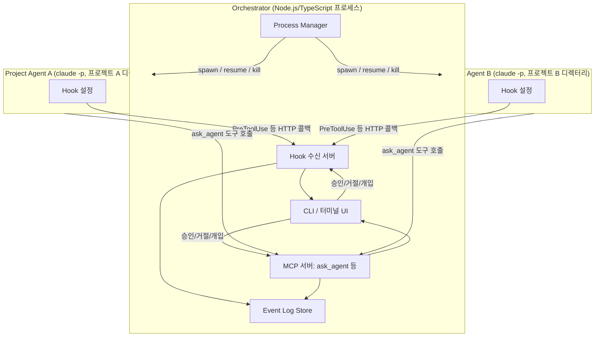
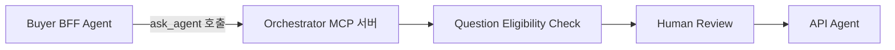

# 아키텍처 설계 (초안)

[mvp-scope.md](mvp-scope.md)에서 정의한 범위(2개 Project Agent + Orchestrator 중계 + Q&A 게이트 + Intervention + Event Log, CLI 인터페이스)를 실제로 어떻게 구현할지를 다룬다.

## 1. 기본 아이디어

Claude Code는 "여러 Claude Code 프로세스를 외부에서 감시·제어하는" 공식 기능을 제공하지 않는다. 대신 다음 세 가지 공식 기능을 조합해서 오케스트레이터를 구성한다.

| 기능 | 이 프로젝트에서의 역할 |
|---|---|
| 헤드리스 실행(`claude -p`) + `--resume` | Project Agent를 오케스트레이터의 자식 프로세스로 실행/재개 |
| Hook (`PreToolUse` 등) | 도구 호출 직전 오케스트레이터에게 "이거 해도 돼?"라고 물어보게 강제 → Event Log + 승인 게이트 + Intervention의 공통 진입점 |
| MCP 서버(커스텀 도구) | Agent 간 통신 수단을 오케스트레이터가 만든 도구 하나로 제한 |

Claude Code 자체의 내장 멀티에이전트 실험 기능(teammate 간 직접 메시징)은 §7 "Agent 간 직접 통신 금지" 원칙과 반대 방향이라 사용하지 않는다.

## 2. 구성 요소



- **Process Manager**: 프로젝트별로 `claude -p` 프로세스를 spawn/resume/kill한다. Agent마다 별도의 `CLAUDE_CONFIG_DIR`을 지정해 세션·설정 충돌을 막는다.
- **Hook 수신 서버**: 각 Agent의 hook이 보내는 이벤트(도구 호출 직전/직후 등)를 받는 로컬 HTTP 서버.
- **MCP 서버**: 각 Agent에게 주입되는 커스텀 도구(`ask_agent` 등)를 구현한다. 이게 Agent 간 통신의 유일한 통로다.
- **Event Log Store**: Hook과 MCP 서버를 거친 모든 이벤트를 시간순으로 쌓는다.
- **CLI**: Human이 로그를 보고 승인/거절/개입 명령을 입력하는 터미널 인터페이스.

## 3. Agent 간 통신 강제 (§7 대응)

각 Project Agent에게는 다른 프로젝트와 대화할 수 있는 방법이 `ask_agent`라는 도구 하나뿐이다. 이 도구는 오케스트레이터가 직접 구현해서 제공하기 때문에, 호출은 예외 없이 오케스트레이터를 거친다. Agent 코드나 프롬프트가 어떻게 되어 있든, 물리적으로 다른 통로가 없다.



## 4. 승인 게이트 (§8~11 대응)

`ask_agent` 호출은 MCP 서버가 직접 처리하므로, 오케스트레이터는 호출 시점에 응답을 바로 돌려주지 않고 Human이 승인할 때까지 보류할 수 있다.

1. Agent A가 `ask_agent(target, question)` 호출
2. 오케스트레이터가 Question Eligibility Check(§8) 수행 — 필요하면 Agent A에게 보완 요청
3. CLI에 승인 대기 항목으로 표시 → Human이 승인/거절
4. 승인되면 Agent B의 다음 턴에 질문 전달 (`--resume`으로 프롬프트 주입)
5. Agent B의 답변도 동일하게 Answer Eligibility Check(§10) → Human Review를 거쳐 Agent A에게 전달
6. 답변 상태(`ANSWERABLE` / `UNKNOWN` 등, §11)는 데이터 모델 설계 단계에서 스키마로 확정

### 4.1 실측 검증 (v2.1.238, macOS)

"오케스트레이터가 `ask_agent` 응답을 얼마나 오래 보류할 수 있는가"(§11 미해결 사항 3번)를 직접 실험했다. `zod`(v3) + `@modelcontextprotocol/sdk`로 임의 지연 후 응답하는 MCP 서버(`slow_echo` 도구)를 만들어 `--mcp-config`로 연결하고, 지연 시간을 늘려가며 `claude -p`가 응답을 기다리는지 확인했다.

| 지연 시간 | 결과 |
|---|---|
| 60초 | 정상 수신 (`echo after 60003ms`, 전체 소요 65초) |
| 300초(5분) | 정상 수신 (`echo after 300008ms`, 전체 소요 306초) — 타임아웃 없음 |

**결론 (§11 미해결 사항 3번 해소)**: 적어도 5분까지는 MCP 도구 호출 응답을 지연시켜도 세션이 끊기거나 에러가 나지 않았다. Human Review가 몇 분 정도 걸리는 건 문제가 되지 않는다고 판단해도 된다. 다만 5분보다 훨씬 긴 보류(예: 몇 시간)에 대해서는 아직 확인되지 않았으므로, 오케스트레이터 설계 시 "장시간 미승인 상태"는 별도의 안전장치(예: 일정 시간 후 알림, 혹은 임시로 요청을 큐에 저장하고 도구 호출 자체는 타임아웃 처리)를 고려하는 게 안전하다.

## 5. Human Intervention 구현 (§12 대응)

공식 문서 확인 결과, `claude -p` 헤드리스 프로세스에 **`SIGTERM`**을 보내면 다음이 명시적으로 보장된다.

- 프로세스가 exit code 143으로 종료된다.
- 진행 중이던 턴은 "미완료" 상태로 기록되고, 이후 `--resume <session_id>`로 재개하면 **그 미완료 턴을 이어서** 계속 진행한다.

이 동작은 도구 실행 도중에도 적용되므로, 당초 우려했던 "다음 도구 호출 직전까지만 개입 가능"이라는 한계가 상당 부분 해소된다. 이를 기준으로 Intervention을 다음과 같이 구현한다.

- **Pause**: Agent 프로세스에 `SIGTERM`을 보낸다. 오케스트레이터는 이후 자동으로 재개하지 않고 대기한다.
- **Resume**: `--resume <session_id>`로 프로세스를 다시 spawn한다 — `SIGTERM`이 남긴 미완료 턴을 이어서 계속한다.
- **Stop**: Pause와 동일하게 `SIGTERM`을 보내되, 이후 재개하지 않는다. (Pause와 Stop은 신호 자체는 같고 "나중에 resume하느냐"만 다르다.)
- **Direct Instruction**: `SIGTERM`으로 현재 턴을 중단시킨 뒤, `--resume` 시 새 지시를 프롬프트로 얹어서 전달한다. 완전한 실시간 끼어들기는 아니지만, 도구 호출 경계를 기다릴 필요 없이 즉시 개입할 수 있다.

> **왜 SIGINT가 아니라 SIGTERM인가**: 인터랙티브 모드의 Esc-Esc에 대응하는 `SIGINT`도 존재하지만, 공식 문서에는 "턴을 정상적으로 끝낸다"는 것 외에 정확한 종료 상태나 `--resume` 가능 여부가 명시되어 있지 않다. 반면 `SIGTERM`은 "미완료 턴 + `--resume`으로 이어서 진행"이 명시적으로 문서화되어 있어 이쪽을 채택한다.
>
> **주의**: 도구 호출 완료 시 발생하는 `Stop` hook은 사용자 인터럽트(`SIGINT`/`SIGTERM`)로 종료된 경우에는 실행되지 않는다고 문서에 명시되어 있다. 따라서 pause/stop 이벤트는 hook이 아니라 **오케스트레이터가 자신이 직접 자식 프로세스를 종료시켰다는 사실 자체**로 인지한다(프로세스를 spawn한 주체이므로 이 정보는 이미 갖고 있다). `SessionEnd` hook은 참고용으로만 활용한다.

### 5.1 실측 검증 (v2.1.238, macOS)

문서에 명시되지 않은 부분(§11의 미해결 사항 1번)을 로컬 환경에서 직접 실험으로 확인했다.

**실험 1: 도구 실행 도중 `SIGTERM` 전송**

`Bash` 도구로 5초 이상 걸리는 실제 작업(`dd if=/dev/urandom of=/dev/null bs=1m count=15000`)을 실행시킨 뒤, 그 도구 호출이 진행 중인 시점에 부모 프로세스로 `SIGTERM`을 보냈다.

- 부모 `claude -p` 프로세스: exit code `143` (문서와 일치)
- `dd` 자식 프로세스: `SIGTERM`과 함께 정리됨. 고아 프로세스로 남지 않음 (v2.1.214의 "SIGTERM 중 Bash 프로세스 트리가 고아로 남는 버그" 수정이 반영된 것으로 보임)
- 세션 트랜스크립트에는 중단된 도구 호출이 `"Exit code 137"`(=128+SIGKILL, 도구 실행에 사용된 하위 프로세스가 SIGKILL로 정리됨)을 반환한 `tool_result` 에러로 기록됨 — 즉 "미완료"라기보다는 "에러로 종료된 도구 호출"로 남는다.

**실험 2: `SIGTERM` 이후 `--resume`**

- **프롬프트 없이 재개** (`claude -p --resume <id>`, `claude -p "" --resume <id>`): 둘 다 실패.
  ```
  Error: No deferred tool marker found in the resumed session. Either the session
  was not deferred, the marker is stale (tool already ran), or it exceeds the
  tail-scan window. Provide a prompt to continue the conversation.
  ```
  이 "deferred tool marker" 메커니즘은 SIGTERM 중단과는 무관한 별개 기능(백그라운드/비동기 도구 지연 처리용)으로 보이며, 우리 시나리오에는 해당하지 않는다.
- **실제 프롬프트와 함께 재개** (`claude -p "계속 진행해줘" --resume <id>`): 정상 동작. Agent는 직전 도구 호출이 에러(위 Exit code 137)로 끝났다는 걸 트랜스크립트에서 인지하고 그에 맞게 반응함(예: 재승인을 요청하거나 상황을 설명).

**결론 (§11 미해결 사항 1번 해소)**: `SIGTERM`으로 중단한 세션은 **반드시 프롬프트와 함께 `--resume`해야 한다.** 프롬프트 없는 재개는 지원되지 않는다. 따라서 §5의 Pause/Resume/Direct Instruction 설계에서 "Resume"은 항상 최소한 "계속 진행해" 수준의 placeholder 프롬프트를 함께 보내야 하며, 오케스트레이터가 이를 기본값으로 준비해두어야 한다.

## 6. Event Log 파이프라인 (§13 대응)

각 Agent의 hook(`PreToolUse`, `PostToolUse`, `SessionStart`, `SessionEnd` 등)이 오케스트레이터의 Hook 수신 서버로 이벤트를 보낸다. MCP 서버를 거치는 질문/답변/Intervention 이벤트도 같은 Event Log Store에 함께 쌓여, CLI에서 시간순으로 조회할 수 있다.

## 7. Agent 상태 매핑 (§14 대응)

Agent 상태(`ANALYZING`/`IMPLEMENTING`/`WAITING_APPROVAL` 등)는 오케스트레이터가 Hook/MCP 이벤트를 관찰하며 계산하는 파생 값이다. 예를 들어 `ask_agent` 호출 후 승인 대기 중이면 `WAITING_APPROVAL`, hook 응답을 보류 중이면 `PAUSED`로 표시한다. 정확한 상태 전이 규칙은 데이터 모델 설계 단계에서 확정한다.

## 8. 기술 스택: Node.js / TypeScript

- Claude Code 생태계(MCP SDK 등)가 JS/TS 중심이라 연동이 가장 매끄럽다.
- 자식 프로세스 관리(`child_process`), stdout 스트림(JSON Lines) 파싱, HTTP 서버(hook 수신 + MCP 서버) 모두 표준 라이브러리·성숙한 패키지로 충분히 처리 가능하다.
- Windows/macOS 양쪽에서 Node.js 런타임 자체의 이식성은 검증되어 있다.

## 9. 프로세스 격리

Agent마다 별도의 `CLAUDE_CONFIG_DIR`을 지정해 세션 데이터와 설정이 서로 섞이지 않게 한다. 프로젝트 디렉터리(cwd)는 각 프로젝트의 실제 경로를 그대로 사용한다.

## 10. Claude Code 버전 요구사항

이 문서의 설계는 로컬에서 확인된 `2.1.238` 기준 공식 문서로 조사했다. 다만 각 기능이 정확히 몇 버전부터 지원되는지는 공식 문서/CHANGELOG에 명시되어 있지 않아, 아래는 CHANGELOG의 버그 수정 기록 등에서 역산한 **추정치**임을 명확히 한다.

| 기능 | 확인 방법 | 결과 |
|---|---|---|
| `SIGTERM` 시 미완료 턴 기록 + `--resume`으로 이어서 진행 | headless.md에 동작 자체는 명시. 도입 버전은 불명시 | v2.1.214에서 "SIGTERM 중 Bash 프로세스 트리가 고아 프로세스로 남는 버그" 수정 기록 있음 → 기능 자체는 그 이전부터 존재했을 것으로 추정 |
| Hook 이벤트(`PreToolUse`/`PostToolUse`/`SessionStart`/`SessionEnd`/`Stop`/`StopFailure`/`UserPromptSubmit`) | hooks.md에 동작은 명시. 도입 버전은 불명시 | CHANGELOG가 v2.1.209부터만 접근 가능해 그 이전 도입 시점은 확인 불가 |
| 프로젝트 레벨 MCP 서버 설정(`--mcp-config`) | headless.md/cli-reference.md에 동작은 명시. 도입 버전은 불명시 | v2.1.210 전후로 관련 버그 수정 기록 다수 |
| 별도 Agent 세션 격리(`CLAUDE_CONFIG_DIR`, `CLAUDE_CODE_PROJECT_DIR_NAME`) | 공식 문서에 버전 명시 있음 | `CLAUDE_CODE_PROJECT_DIR_NAME`은 v2.1.234+ |

**권장 최소 버전**: `v2.1.234` (`CLAUDE_CODE_PROJECT_DIR_NAME` 지원이 명시적으로 확인되는 가장 이른 버전 기준). 이보다 낮은 버전에서 다른 기능들이 동작하지 않는다는 근거는 없지만, 확인된 바가 없으므로 개발/테스트는 이 버전 이상에서 진행하는 것을 권장한다.

이 표의 "도입 버전 불명시" 항목들은 정확한 버전이 필요할 경우 Anthropic에 `/feedback`으로 별도 문의가 필요하다.

## 11. 미해결 사항

- ~~`SIGTERM` 이후 `--resume` 시 새 프롬프트 없이 순수하게 미완료 턴만 이어가는 것이 가능한지~~ → §5.1 실측 검증에서 해소. 불가능하며, 항상 프롬프트가 필요하다.
- Answer 상태 enum, Agent 상태 enum의 정확한 스키마 — 데이터 모델 설계 단계에서 확정
- ~~`ask_agent` MCP 도구 호출에 대한 응답을 오케스트레이터가 얼마나 오래 보류할 수 있는지(타임아웃 존재 여부)~~ → §4.1 실측 검증에서 해소. 최소 5분까지는 타임아웃 없음. 그 이상 장시간 보류는 별도 안전장치 필요
- 위 기능들의 정확한 도입 버전 (공식 문서에 명시 없음, 필요시 Anthropic 문의)

## 다음 단계

미해결 사항 확인 후, 데이터 모델(Event Log / Question / Answer / Agent 상태 스키마) 설계로 진행한다.
