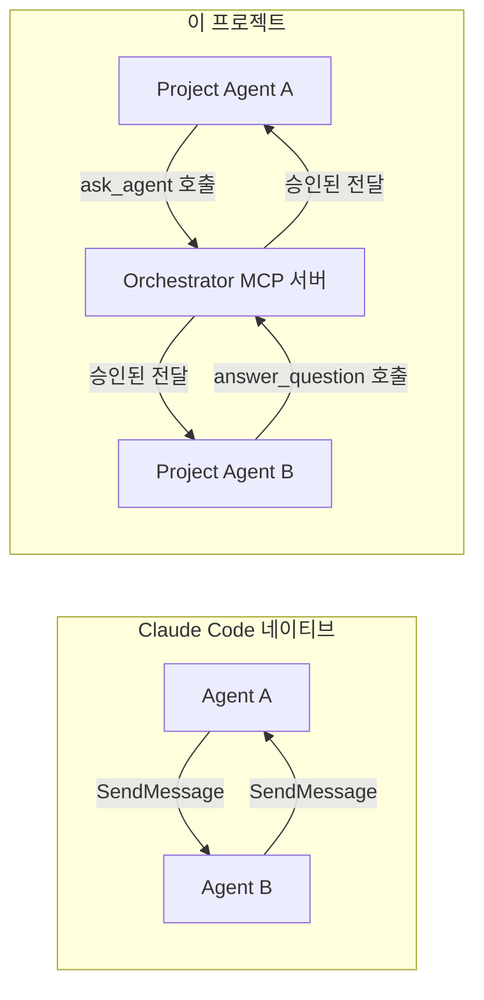
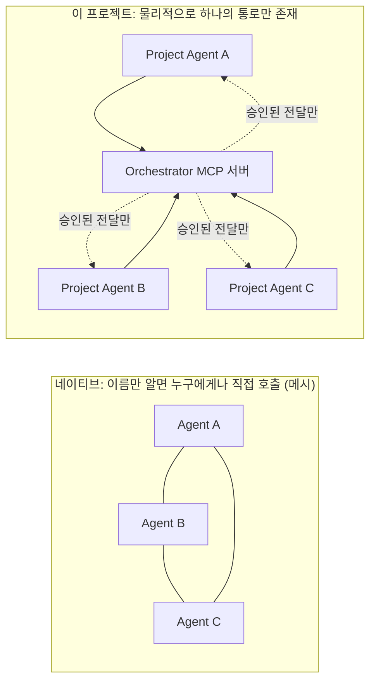
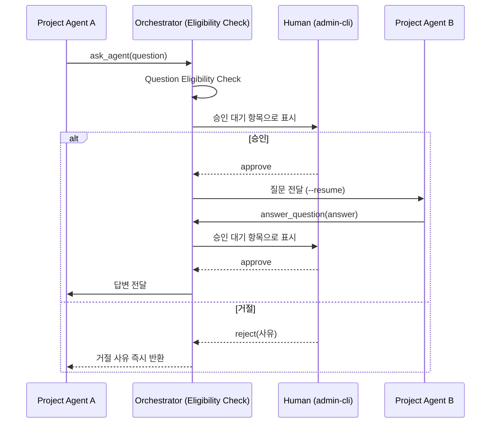
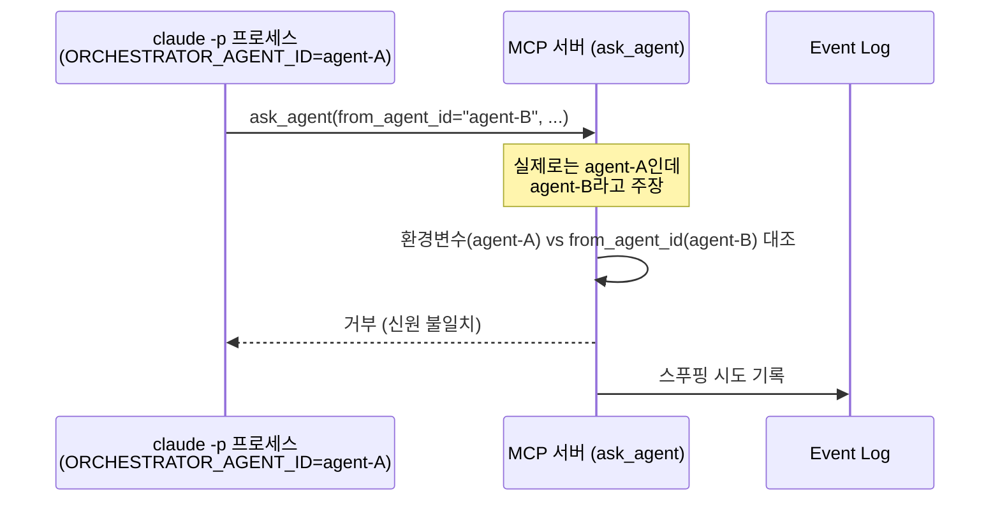
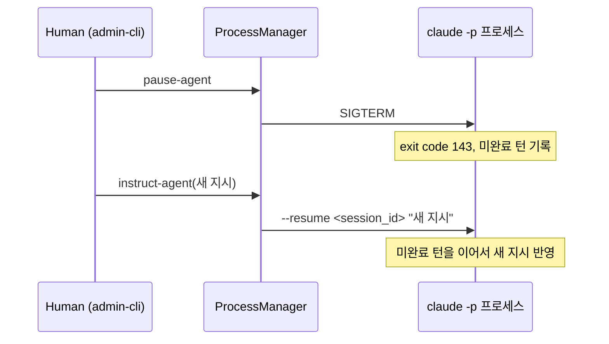

# 이 프로젝트의 파이프라인 vs Claude Code 네이티브 멀티 에이전트 기능 비교

이 프로젝트(`ask_agent`/`answer_question` MCP 게이트 + Orchestrator)를 설계할 당시([architecture.md](architecture.md) §1)에는 "Claude Code 자체의 내장 멀티에이전트 실험 기능(teammate 간 직접 메시징)은 [requirements.md](requirements.md) §7 'Agent 간 직접 통신 금지' 원칙과 반대 방향이라 사용하지 않는다"고만 짧게 기록해두었다. 이후 Claude Code 세션 안에서 `Agent`/`SendMessage`/`ListAgents` 툴을 직접 관찰하면서, 그 "내장 기능"이 실제로 어떻게 동작하는지 더 구체적으로 파악하게 됐다. 이 문서는 그 구체적인 동작 방식을 이 프로젝트의 설계와 항목별로 대조해서, "왜 여전히 Orchestrator를 거치는 구조가 필요한가"를 명시적으로 정리한다.

> **출처 주의**: 이 문서의 "네이티브 기능" 설명은 실제 Claude Code 세션에서 `Agent`/`SendMessage`/`ListAgents` 툴을 사용/관찰하며 얻은 정보에 근거하며, 이 저장소의 다른 실측 문서([architecture.md](architecture.md) §4.1, §5.1 등)처럼 별도의 재현 실험을 거치지는 않았다. 버전에 따라 세부 동작이 달라질 수 있다.

## 1. 두 메커니즘 개요

| | Claude Code 네이티브 (`Agent` + `SendMessage`) | 이 프로젝트 (`ask_agent`/`answer_question` MCP + Orchestrator) |
|---|---|---|
| 전송 방식 | 이름(name)을 주소로 삼아 대상 세션의 입력 큐에 비동기로 메시지를 넣음 | Agent가 MCP 도구(`ask_agent`)를 호출 → Orchestrator가 SQLite에 `Question`/`Answer` 레코드로 적재 |
| 응답 수신 | 발신자는 블로킹하지 않고 계속 진행, 응답은 나중에 별도 turn(알림)으로 도착 | 발신 Agent는 도구 호출 자체가 사람이 승인할 때까지 보류됨(§4.1 실측: 5분까지 타임아웃 없음 확인) — 도구 호출 관점에서는 동기적으로 보이지만 실제 응답까지는 Human Review가 끼어 있음 |
| 세션 재개 | 이미 존재하는 이름으로 다시 `SendMessage`하면 해당 세션이 기존 컨텍스트를 유지한 채 재개(resume)됨 | `ProcessManager`가 `claude -p --resume <session_id>`로 프로세스를 다시 spawn — SIGTERM 이후 재개 시 프롬프트가 반드시 필요함(§5.1 실측) |
| 격리 단위 | 같은 계정/세션 범위 안의 서브에이전트, 팀원, 로컬/클라우드 세션 | 서로 다른 **프로젝트 디렉터리**(cwd)를 가진 독립 `claude -p` 프로세스, 프로젝트별 별도 MCP 서버 인스턴스 |

네이티브는 A와 B가 이름만 알면 서로 직접 주고받고, 이 프로젝트는 둘 사이에 반드시 Orchestrator MCP 서버가 끼어 있다는 것이 그림상으로도 드러난다.

## 2. 항목별 비교

### 2.1 통신 경로 강제 여부

- **네이티브**: `SendMessage({ to, message })`는 이름만 알면 누구든 호출할 수 있는 범용 프리미티브다. 통신 경로를 중간에서 강제로 가로채는 별도 게이트가 없다.
- **이 프로젝트**: [requirements.md §7](requirements.md#7-agent-간-통신)에 따라 "Agent끼리 직접 통신하는 구조는 기본 모델로 사용하지 않는다"를 원칙으로 못박고, [architecture.md §3](architecture.md#3-agent-간-통신-강제-7-대응)에서 이를 구조적으로 강제한다 — 각 Project Agent에게 다른 프로젝트와 대화할 방법은 오케스트레이터가 구현한 `ask_agent` 도구 **하나뿐**이라, 프롬프트가 어떻게 되어 있든 물리적으로 다른 통로가 없다.

이 차이가 이 문서 전체에서 가장 중요한 지점이다. 네이티브 `SendMessage`는 "누구나 누구에게나 바로 말 걸 수 있는 것"을 전제로 설계된 반면, 이 프로젝트는 그 전제 자체를 의도적으로 깨고 모든 통신을 단일 지점으로 몰아서 그 위에 검증·기록·승인을 얹는 것이 목적이다.

### 2.2 승인 게이트

- **네이티브**: 사람의 승인 없이 메시지가 바로 상대 세션에 전달된다.
- **이 프로젝트**: [requirements.md §8~11](requirements.md#8-질문-생성-품질-검증)의 Question/Answer Eligibility Check를 거친 뒤, `admin-cli`로 Human이 승인/거절해야 실제로 전달된다([architecture.md §4](architecture.md#4-승인-게이트-8~11-대응), §12.2 실측 검증 완료). 거절 시에는 사유가 그대로 발신 Agent에게 돌아간다.

네이티브는 이 다이어그램의 "Human (admin-cli)" 단계 자체가 없다 — `A->>B`로 바로 이어진다.

### 2.3 발신자 신원 검증

- **네이티브**: `ListAgents`가 보여주는 이름은 관찰 가능한 상대 목록이지, 메시지 본문 안에서 "내가 누구인지"를 스스로 주장하는 필드는 별도로 검증되지 않는다(적어도 이 세션에서 관찰된 범위 내에서는 이름=주소이므로 스푸핑의 여지가 근본적으로 적은 모델이긴 하다).
- **이 프로젝트**: Agent마다 별도 서브프로세스로 뜨고 `ORCHESTRATOR_AGENT_ID` 환경변수로 실제 프로세스 신원을 서버 쪽에서 검증한다. `ask_agent` 호출 시 `from_agent_id`를 거짓 주장하면 거절하고 그 시도 자체를 Event Log에 남긴다([README.md](../README.md) 현재 상태 항목, §17). 이건 "이름이 곧 신뢰"가 아니라 "이름 주장은 검증 대상"이라는, 더 방어적인 모델이다.

### 2.4 권한 제한 (최소 권한 원칙)

- **네이티브**: 서브에이전트 종류(`subagent_type`)별로 사용 가능한 툴셋이 정의되어 있지만, 이는 "이 역할은 보통 이런 툴이 필요하다"는 설계적 배정이다.
- **이 프로젝트**: Scribe Agent에게는 `mcp__orchestrator__submit_decision_record` 도구 **하나만** 부여한다([architecture.md §13.1](architecture.md#131-설계-요약)). `Bash`/`Edit`/`Write`/`ask_agent`가 원천적으로 없으므로 "Scribe가 코드를 고치거나 다른 Agent에게 지시하는" 시나리오가 프롬프트 수준이 아니라 **구조적으로** 불가능하다([requirements.md §19](requirements.md#19-scribe는-결정을-내리지-않는다) "Scribe는 결정하지 않는다"를 권한으로 강제).

### 2.5 기록/감사 가능성

- **네이티브**: 세션 간 메시지 교환 자체를 위한 별도의 영속 감사 로그·검색 인터페이스는 제공되지 않는다(각 세션의 대화 히스토리 안에는 남지만, 프로젝트를 가로지르는 통합 조회 수단은 아니다).
- **이 프로젝트**: 모든 Hook 이벤트(`SESSION_START`/`TOOL_PRE`/`TOOL_POST`/`SESSION_END`)와 Q&A 이벤트(`QUESTION_CREATED`/`QUESTION_REVIEWED`/`ANSWER_CREATED`/`ANSWER_REVIEWED`)가 같은 Event Log에 시간순으로 쌓이고([architecture.md §6](architecture.md#6-event-log-파이프라인-13-대응)), 사유가 있는 거절은 자동으로 Decision Record 초안 생성을 트리거해 배경·제약·선택지·근거를 사람이 읽을 수 있는 글로 남긴다([architecture.md §13](architecture.md#13-phase-2-scribe-agent와-decision-record)). `search-decisions`/`show-decisions-for-file`로 과거 결정을 검색하거나 특정 파일에 연결된 결정을 역추적할 수 있다.

### 2.6 Human 개입 (Pause/Resume/Direct Instruction)

- **네이티브**: 세션을 다른 세션이 직접 멈추거나 프롬프트를 강제로 주입하는 공식 인터페이스는 이 비교의 관찰 범위 밖이다(사용자가 각 세션과 직접 상호작용하는 것이 기본 모델).
- **이 프로젝트**: `SIGTERM` 기반 Pause/Resume/Stop, `--resume` 시 새 지시를 얹는 Direct Instruction을 구현하고 실제 `claude -p` 세션으로 검증했다([architecture.md §5](architecture.md#5-human-intervention-구현-12-대응), §5.1, §12.6). "미완료 턴 기록 + `--resume`으로 이어서 진행"이 공식 문서에 명시된 동작임을 확인하고 그 위에 CLI 인터페이스를 얹은 것이다.

이 흐름 전체(Pause → Direct Instruction → Resume)를 세션 밖에서 프로그래매틱하게 트리거하는 공식 인터페이스는, 이 비교의 관찰 범위 안에서는 네이티브 쪽에 확인되지 않았다.

### 2.7 다중 프로젝트 스케일

- **네이티브**: 세션 이름/ref로 여러 상대를 구분하는 것은 가능하지만, "프로젝트 로스터를 각 Agent에게 자연어로 미리 공지해서 필요할 때 스스로 통신 도구를 쓰게 한다"는 워크플로우 자체를 제공하지는 않는다.
- **이 프로젝트**: `orchestrator.config.json`의 Agent 항목에 `role`을 채우면 다른 Agent들에게 협업 로스터로 전달되고, 코드 변경 없이 3개 이상 프로젝트로 확장되는 것까지 실제 사용자 프로젝트로 검증됐다([real-project-verification.md](real-project-verification.md)).

## 3. 구조적으로 겹치는 지점 (앞으로 검토할 부분)

완전히 겹치지 않는다고 보기는 어려운 지점이 하나 있다.

- `src/process-manager.ts`가 `child_process`로 `claude -p` 세션을 직접 spawn/pause/resume/stop하는 부분은, 네이티브 세션 관리(이름/ref 부여, 세션 목록화)가 다루는 문제와 개념적으로 인접하다. 다만 이 프로젝트가 필요로 하는 것은 "세션이 존재한다"는 것 자체가 아니라 **SIGTERM 시점의 exit code, `--resume` 시 프롬프트 필수 여부** 같은 프로세스 레벨의 세부 동작이라([architecture.md §5.1](architecture.md#51-실측-검증-v21238-macos)), 지금 당장 네이티브 세션 관리로 대체할 근거는 없다. 다만 향후 네이티브 쪽에서 이런 제어(pause/resume을 세션 밖에서 프로그래매틱하게 트리거하는 것 등)를 공식 지원하게 되면, `ProcessManager`를 그 위에 얇게 올리는 리팩터링을 검토할 수 있다.

## 4. 결론

네이티브 `SendMessage`/`Agent`/`ListAgents`는 "독립된 세션끼리 메시지를 주고받는" **전송 계층**을 제공한다. 이 프로젝트가 실제로 구현한 것은 그 위(또는 그것과 별개)에 있는 **거버넌스 계층**이다 — 승인 게이트, 신원 검증, 최소 권한 강제, 감사 가능한 Decision Record, Human Intervention, 다중 프로젝트 로스터 라우팅. 이 항목들은 §7 "Agent 간 직접 통신 금지"라는, 네이티브 모델과는 정반대 방향의 설계 원칙에서 나온 것이라 네이티브 기능의 존재 여부와 무관하게 유지된다.

즉 두 메커니즘은 대체 관계가 아니라, "메시지를 어떻게 보내는가"(네이티브가 잘하는 것)와 "그 메시지 교환을 누가 언제 승인하고 왜 그런 결정을 내렸는지 남기는가"(이 프로젝트가 다루는 것)로 다루는 문제 자체가 다르다.
