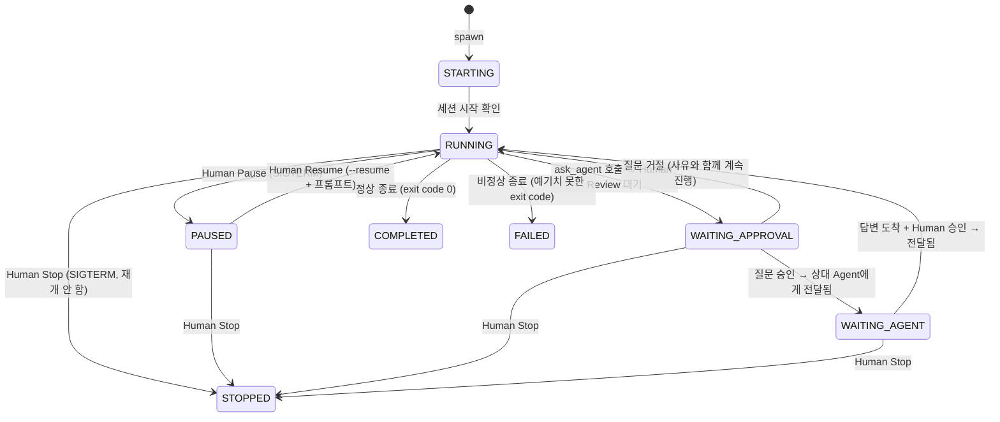
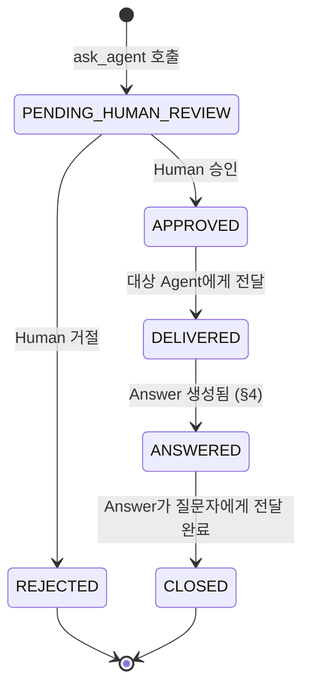
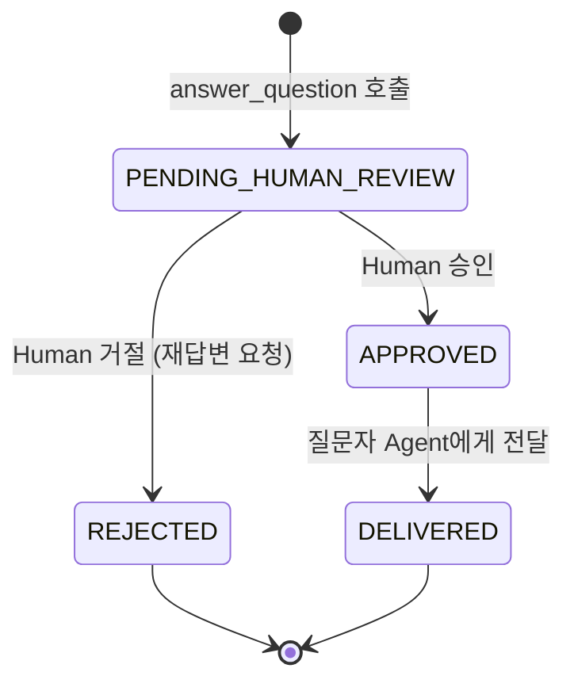
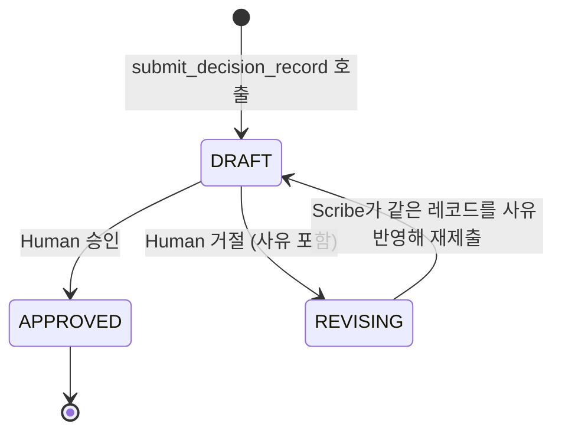
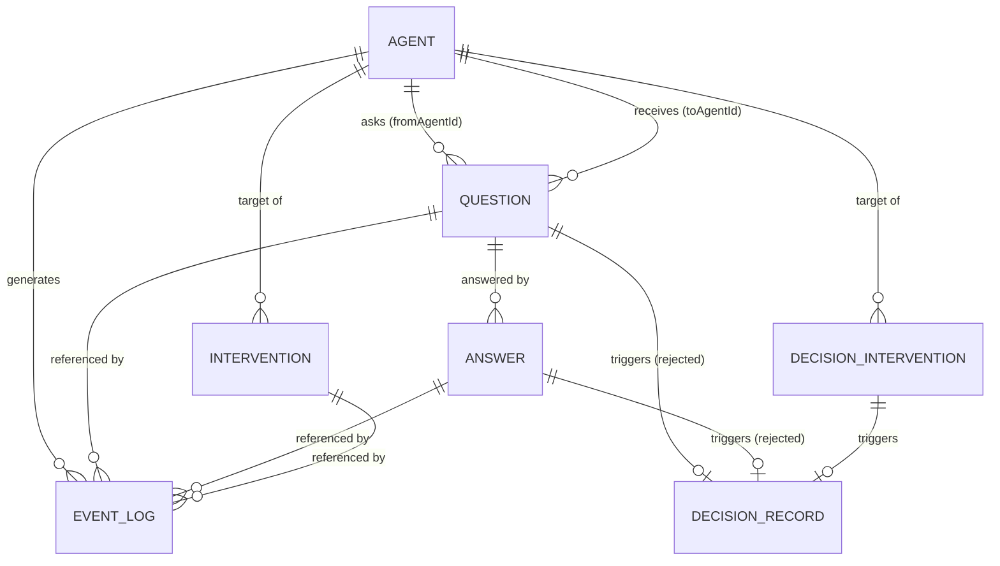

# 데이터 모델 설계

[architecture.md](architecture.md)에서 정의한 구성 요소(Process Manager, Hook 수신 서버, MCP 서버, Event Log Store)가 실제로 다루는 데이터의 스키마를 정의한다. §2~6은 Phase 1(MVP) 범위, §7(Decision Record)은 Phase 2 범위다.

## 1. 설계 원칙: 원시 데이터와 파생 표시를 분리한다

이 문서 전반에서 반복되는 패턴 하나를 먼저 명시한다.

- 오케스트레이터가 **확실하게 아는 사실**(프로세스가 살아있는지, MCP 도구 응답을 보류 중인지, exit code가 몇인지)은 신뢰 가능한 **상태 값**으로 다룬다.
- 반면 **도구 이름이나 명령어 내용으로부터 추측해야 하는 것**(지금 "분석" 중인지 "구현" 중인지, 이 Bash 명령이 테스트인지)은 오탐 가능성이 있는 **파생 라벨**로만 다루고, CLI 표시 이상의 용도로 쓰지 않는다.

Agent 상태(§2)와 Event Log(§4) 모두 이 구분을 따른다.

## 2. Agent

### 2.1 엔티티

| 필드 | 타입 | 설명 |
|---|---|---|
| `id` | string | Agent 식별자 (예: `api-agent`) |
| `projectPath` | string | 담당 프로젝트 디렉터리(cwd) |
| `claudeConfigDir` | string | `CLAUDE_CONFIG_DIR` — Agent별 세션/설정 격리 |
| `sessionId` | string \| null | 현재 Claude Code 세션 ID. 아직 시작 전이면 `null` |
| `pid` | number \| null | 현재 자식 프로세스 PID. 실행 중이 아니면 `null` |
| `lifecycleState` | `AgentLifecycleState` | §2.2 |
| `activityLabel` | `AgentActivityLabel` \| null | §2.3, 참고용 |
| `pendingQuestionId` | string \| null | 이 Agent가 낸 질문 중 아직 안 끝난 게 있으면 참조 |
| `updatedAt` | datetime | 마지막 상태 변경 시각 |

### 2.2 Lifecycle State (신뢰 가능, 오케스트레이터 동작을 결정)



- **원본 §14 enum과의 차이**: `ANALYZING`/`PLANNING`/`IMPLEMENTING`/`TESTING`은 도구 호출 내용으로부터 추측해야 하는 값이라 신뢰도가 낮으므로 `RUNNING` 하나로 합치고, 세부 구분은 §2.3의 참고용 라벨로 뺐다. `WAITING_HUMAN`은 의미상 `WAITING_APPROVAL`과 겹쳐서(둘 다 "Human의 판단을 기다림") 하나로 합쳤다.
- `PAUSED`/`STOPPED` 모두 내부적으로는 동일하게 `SIGTERM`을 보내는 동작이다([architecture.md §5](architecture.md#5-human-intervention-구현-12-대응)). 차이는 오케스트레이터가 이후 자동으로 `--resume`을 준비해두느냐(`PAUSED`) 아니냐(`STOPPED`)뿐이다.

### 2.3 Activity Label (참고용, CLI 표시 전용)

가장 최근 Event Log 항목의 `tool_name`을 아래처럼 매핑해 계산한다. 100% 정확하지 않을 수 있음을 CLI에 표시한다.

| tool_name | Activity Label |
|---|---|
| `Read`, `Grep`, `Glob` | `ANALYZING` |
| `Edit`, `Write`, `NotebookEdit` | `IMPLEMENTING` |
| `Bash` (명령어에 `test`, `spec` 등 포함) | `TESTING` |
| `Bash` (그 외) | `IMPLEMENTING` |
| 그 외 / 정보 없음 | `null` |

`PLANNING`은 도구 호출만으로는 구분할 근거가 없어 이번 버전에서는 산출하지 않는다.

## 3. Question

### 3.1 엔티티

| 필드 | 타입 | 설명 |
|---|---|---|
| `id` | string | |
| `fromAgentId` | string | 질문한 Agent |
| `toAgentId` | string | 질문 대상 Agent |
| `text` | string | 질문 내용 |
| `selfJustification` | string | Agent가 `ask_agent` 호출 시 함께 제출하는, 왜 이 질문이 필요한지에 대한 자체 근거(§8 Question Eligibility Check의 결과물) |
| `status` | `QuestionStatus` | §3.2 |
| `humanReviewer` | string \| null | 승인/거절한 Human (MVP는 단일 사용자라 고정값일 수 있음) |
| `reviewReason` | string \| null | 거절 시 사유 |
| `createdAt` / `reviewedAt` / `deliveredAt` | datetime | |

### 3.2 상태 흐름 (§8~9 대응)



`ask_agent` MCP 도구 호출 자체가 `PENDING_HUMAN_REVIEW` 진입점이다. 이 시점에 오케스트레이터는 도구 응답을 보류한다([architecture.md §4.1](architecture.md#41-실측-검증-v2138-macos)에서 확인했듯 최소 5분까지는 타임아웃 없이 보류 가능).

**`REJECTED`가 전달되는 방식**: 별도의 전달 단계가 있는 게 아니라, 거절 자체가 곧 "보류 중이던 `ask_agent` 도구 호출을 `reviewReason`을 담은 결과로 응답해버리는 것"이다. 따라서 질문한 Agent는 자신이 호출한 도구의 반환값으로 거절 사유를 그 자리에서 즉시 받고, 같은 턴 안에서 바로 다음 행동(예: 질문 없이 현재 정보로 진행, 질문을 보완해서 재시도)을 판단하는 데 참고한다. `--resume`으로 새 턴을 열 필요가 없다 — 이 점에서 `APPROVED`/`DELIVERED` 이후의 흐름(대상 Agent의 다음 턴에 프롬프트로 주입, [architecture.md §4](architecture.md#4-승인-게이트-8-11-대응) 4번)과 성격이 다르다.

## 4. Answer

### 4.1 엔티티

| 필드 | 타입 | 설명 |
|---|---|---|
| `id` | string | |
| `questionId` | string | 어떤 Question에 대한 답변인지 |
| `fromAgentId` | string | 답변한 Agent (= Question의 `toAgentId`) |
| `text` | string | 답변 내용 |
| `contentStatus` | `AnswerContentStatus` | §4.2 — 답변 Agent가 스스로 판단한 답변의 인식론적 상태 |
| `reviewStatus` | `AnswerReviewStatus` | §4.3 — Human 승인 워크플로우 상태 |
| `humanReviewer` / `reviewReason` | | Question과 동일한 목적 |
| `createdAt` / `reviewedAt` / `deliveredAt` | datetime | |

두 상태를 분리한 이유는 §2와 같은 원칙이다: `contentStatus`는 Agent가 스스로 매기는 값(오케스트레이터가 검증할 수 없음)이고, `reviewStatus`는 오케스트레이터/Human이 통제하는 워크플로우 값이다.

### 4.2 Content Status (§11 그대로 채택)

```
ANSWERABLE | PARTIALLY_ANSWERABLE | INSUFFICIENT_CONTEXT | OUT_OF_SCOPE | AMBIGUOUS | CONFLICTING_INFORMATION | UNKNOWN
```

`answer_question` MCP 도구의 필수 파라미터로 노출한다(Agent가 답변 텍스트와 함께 이 값을 반드시 선택하게 강제).

### 4.3 Review Status (§10 대응)



`REJECTED`도 Question과 같은 방식으로 전달된다: 보류 중이던 `answer_question` 도구 호출을 `reviewReason`을 담아 응답한다. 답변한 Agent는 같은 턴 안에서 거절 사유를 즉시 받아 답변을 보완한 뒤 `answer_question`을 다시 호출할 수 있고, 이 두 번째 호출이 같은 `questionId`를 참조하는 새 Answer 레코드가 된다(재답변).

## 5. Event Log

### 5.1 엔티티

| 필드 | 타입 | 설명 |
|---|---|---|
| `id` | string | |
| `timestamp` | datetime | |
| `agentId` | string | |
| `sessionId` | string | |
| `type` | `EventType` | §5.2 |
| `source` | `"hook" \| "mcp" \| "orchestrator"` | 어디서 발생했는지 |
| `payload` | JSON | hook/MCP가 보낸 원시 데이터 (tool_name, tool_input, exit_code 등) |
| `relatedQuestionId` / `relatedAnswerId` | string \| null | Question/Answer 관련 이벤트일 때만 |

### 5.2 Event Type

Hook/MCP에서 실제로 오는 원시 이벤트를 그대로 보존한다. "파일 읽기/수정" 같은 의미 분류(§13의 예시)는 CLI가 `payload.tool_name`으로부터 표시 단계에서 파생하며, Event Log 자체의 `type`은 다음처럼 훅/도구 이벤트 이름에 최대한 가깝게 유지한다.

| type | source | 발생 시점 |
|---|---|---|
| `SESSION_START` | hook | Agent 세션 시작 |
| `SESSION_END` | hook | Agent 프로세스 종료 (정상/SIGTERM 모두) |
| `TOOL_PRE` | hook (`PreToolUse`) | 도구 호출 직전 |
| `TOOL_POST` | hook (`PostToolUse`) | 도구 호출 완료 (성공/에러 모두, `payload.is_error`로 구분) |
| `QUESTION_CREATED` | mcp | `ask_agent` 호출 |
| `QUESTION_REVIEWED` | orchestrator | Human이 질문 승인/거절 |
| `ANSWER_CREATED` | mcp | `answer_question` 호출 |
| `ANSWER_REVIEWED` | orchestrator | Human이 답변 승인/거절 |
| `INTERVENTION` | orchestrator | Pause/Resume/Stop/Direct Instruction 발생 (`payload.kind`로 세분화) |
| `DECISION_RECORD_CREATED` | mcp | Scribe Agent가 `submit_decision_record` 호출 (§7) |
| `DECISION_RECORD_REVISED` | mcp | Scribe Agent가 `revising_decision_record_id`로 같은 레코드를 재제출 (§7.3) |
| `DECISION_RECORD_REVIEWED` | orchestrator | Human이 Decision Record 승인/거절 (§7) |
| `DECISION_INTERVENTION_REQUESTED` | orchestrator | Human이 `decide-choice`로 Decision Intervention을 기록 (§7.5) |
| `ASSISTANT_MESSAGE` | orchestrator | Agent가 도구 호출 없이 텍스트로만 응답 (§5.3) |
| `AGENT_IDENTITY_MISMATCH` | mcp | `from_agent_id`가 이 프로세스의 진짜 신원(`ORCHESTRATOR_AGENT_ID`)과 다름 — 신원 위장 시도/버그 (§5.4) |

### 5.3 도구 호출 없는 일반 텍스트 응답 (해결됨)

§5.2의 나머지 `type`은 hook이 걸리는 지점(세션 시작/종료, 도구 호출 전후)과 MCP 도구 호출뿐이라, Agent가 도구를 안 쓰고 말로만 답하는 경우(단순 인사, 서술형 답변 등)는 한동안 어디에도 안 남았다. `ProcessManager`가 claude 프로세스의 stdout(`stream-json`)에서 `session_id`/`system.init`만 상태 전환용으로 읽고, `assistant` 타입 메시지의 텍스트 콘텐츠 블록은 무시했기 때문이다(hook도 도구/세션 경계에만 걸리므로 원래 이 경로는 못 잡는다).

이건 §1의 "원시 데이터와 파생 표시를 분리한다" 원칙과는 다른 종류의 공백이었다 — 파생을 안 한 게 아니라 원시 데이터 자체를 안 모으고 있었다. `resume-agent buyer-bff "안녕"` 실사용 중 발견됐고, `ProcessManager`가 `assistant` 메시지의 `content` 배열에서 `type: "text"` 블록만 뽑아 `assistant-message` 이벤트로 알리면(`src/process-manager.ts`), `Orchestrator`가 이를 구독해 `ASSISTANT_MESSAGE`로 Event Log에 기록하도록 고쳤다(`src/orchestrator.ts`의 `recordAssistantMessage`). `admin-cli list-events`도 이 타입이면 텍스트 미리보기를 같이 보여준다. 실측 검증은 [architecture.md §16](architecture.md#16-도구-호출-없는-일반-텍스트-응답-로깅) 참고.

### 5.4 Agent 신원 위장 시도 기록

`from_agent_id`는 Agent(LLM)가 도구 호출 인자로 스스로 적어 넣는 문자열이라 그 자체로는 신원을 증명하지 못한다. `mcp-server.ts`는 자신을 spawn한 mcp-config의 `ORCHESTRATOR_AGENT_ID` 환경변수(Agent마다 별도 mcp-config 파일에 심어둠)를 진짜 신원으로 삼아, `ask_agent`/`answer_question` 호출의 `from_agent_id`가 이와 다르면(env가 아예 없어도) 무조건 거절하고 `AGENT_IDENTITY_MISMATCH`를 기록한다. `agentId` 필드에는 거짓으로 주장한 값이 아니라 진짜 신원(`ORCHESTRATOR_AGENT_ID`, 없으면 주장한 값)이 들어간다. 실측 검증은 [architecture.md §17](architecture.md#17-agent-신원-검증-123-해결) 참고.

## 6. Intervention

§2~5의 Question/Answer/Event Log와 같은 "요청과 실행을 분리한다" 원칙을 여기서도 따른다. Human(또는 Human을 대신하는 CLI)이 남기는 건 개입 **요청**뿐이고, 이를 실제로 적용(`ProcessManager.pause()`/`resume()`/`stop()` 호출)하는 건 Orchestrator다 — Question/Answer가 Human 승인을 오케스트레이터가 대신 적용하는 것과 동일한 구조다.

### 6.1 엔티티

| 필드 | 타입 | 설명 |
|---|---|---|
| `id` | string | |
| `agentId` | string | 개입 대상 Agent |
| `kind` | `InterventionKind` | §6.2 |
| `prompt` | string \| null | `RESUME`에만 의미 있음. Direct Instruction의 지시 내용이 여기 담긴다 |
| `requestedBy` | string | 요청한 Human |
| `requestedAt` / `appliedAt` | datetime / datetime \| null | 요청 시각과 Orchestrator가 실제로 적용한 시각. `appliedAt`이 `null`이면 아직 대기 중 |

### 6.2 Intervention Kind

```
PAUSE | RESUME | STOP
```

requirements.md §12는 Execution Control(Pause/Resume/Stop/Cancel)과 Direct Instruction을 구분하지만, 여기서는 **Direct Instruction을 별도 kind로 두지 않는다**. §5 Human Intervention 실현 방식(`SIGTERM`으로 턴을 끊고 `--resume` 시 새 지시를 프롬프트로 얹어 전달)을 그대로 따르면, Direct Instruction은 "`PAUSE` 요청 하나 + `prompt`가 있는 `RESUME` 요청 하나"의 조합과 동일하기 때문이다. Agent가 이미 한가하면 `PAUSE`는 아무 효과 없이 지나가고 `RESUME`만 적용된다.

### 6.3 처리 순서

Orchestrator는 미적용 상태(`appliedAt IS NULL`)인 Intervention을 `requestedAt` 순서로 폴링하며 처리한다. `RESUME`은 대상 Agent의 프로세스가 아직 살아있으면(예: 방금 보낸 `PAUSE`가 아직 반영되기 전) 이번 주기에는 건너뛰고 다음 주기에 재시도한다 — Question/Answer 전달과 같은 재시도 방식이다. 적용에 성공하면 `EVENT_LOG`에 `type: INTERVENTION`, `payload: { kind, prompt, requestedBy }`로 기록한다(§5.2).

### 6.4 예외: Scribe Agent

Scribe는 `PAUSE`/`STOP`/프롬프트 없는 `RESUME`은 다른 Agent와 동일하게 적용받지만, **프롬프트가 있는 `RESUME`(Direct Instruction)만은 거부**된다 — Scribe의 유일한 도구(`submit_decision_record`)가 트리거 참조를 검증하지 않아서, 임의 프롬프트를 허용하면 근거 없는 Decision Record를 지어낼 길이 열리기 때문이다(requirements.md §19 "Scribe는 결정하지 않는다"와 같은 원칙 — §7.4 참고). 이 경우 `appliedAt`은 그대로 채워지지만(재시도 대상에서는 빠짐), `EVENT_LOG` payload에 `rejected: true`와 `reason`이 추가로 담긴다 — 조용히 사라지지 않고 왜 적용 안 됐는지 남긴다. 자세한 근거와 실측 검증은 [architecture.md §19](architecture.md#19-scribe에-대한-human-intervention-제한) 참고.

## 7. Decision Record (Phase 2 + Phase 3)

requirements.md §15~20 참고. §3~6까지의 모든 엔티티와 같은 "요청/초안 → Human 승인 → 확정" 패턴을 그대로 따른다: Question/Answer 거절(사유 포함)이나 Decision Intervention(§7.5)이 자동으로 Scribe Agent를 깨우는 트리거가 되고, Scribe가 초안을 작성하면 Human이 승인해야 확정된다. Phase 3 범위 정의는 [phase3-scope.md](phase3-scope.md) 참고.

### 7.1 엔티티

| 필드 | 타입 | 설명 |
|---|---|---|
| `id` | string | |
| `triggerType` | `"QUESTION_REJECTED" \| "ANSWER_REJECTED" \| "DECISION_INTERVENTION"` | §7.2 |
| `triggerQuestionId` / `triggerAnswerId` / `triggerDecisionInterventionId` | string \| null | 트리거가 된 Question/Answer/Decision Intervention |
| `background` | string | §17 "배경" |
| `problem` | string | §17 "문제" |
| `constraints` | string | §17 "제약사항" |
| `options` | string | §17 "선택지" |
| `optionsComparison` | string | §17 "선택지 비교" |
| `rationale` | string | §17 "판단 근거" |
| `conclusion` | string | §17 "결론" |
| `decisionMaker` | string | §17 "결정 주체" — 트리거가 된 Question/Answer/Decision Intervention의 `humanReviewer`/`requestedBy` |
| `relatedInfo` | string \| null | §17 "관련 정보" |
| `relatedFilePaths` | string[] | phase3-scope.md §4.1: 이 결정과 관련된 파일 경로. DB에는 JSON 텍스트로 저장(`event_log.payload`와 같은 패턴) |
| `status` | `DecisionRecordStatus` | §7.3 |
| `humanReviewer` / `reviewReason` | string \| null | Human 승인/거절 시 |
| `createdAt` / `reviewedAt` | datetime | |

`background`~`relatedInfo`는 구조화된 하위 필드 대신 자유 서술(텍스트/마크다운)로 저장한다. Scribe(LLM)에게 고정 스키마의 선택지 비교표 같은 걸 강제하는 것보다, §15 "사람이 이해할 수 있는 기록"이라는 목적에 맞게 자연스러운 글로 쓰게 하는 편이 낫다고 판단했다. `relatedFilePaths`도 같은 이유로 Scribe의 판단에 맡긴다 — Orchestrator는 트리거가 된 Agent가 최근 다룬 파일 목록(Event Log의 `TOOL_PRE` 중 `Read`/`Edit`/`Write`의 `tool_input.file_path`)만 참고 자료로 프롬프트에 넣어주고, 그중 실제로 관련 있는 파일을 고르는 건 자동화하지 않는다(phase3-scope.md §3.1과 같은 원칙).

### 7.2 트리거 (자동, 범위를 좁게 잡음)

Orchestrator가 폴링하며 다음을 우선순위대로 감지해 하나씩만 Scribe에게 넘긴다(Scribe는 한 번에 하나만 처리 가능).

1. `status = REVISING`인 Decision Record — §7.3 재작성 경로. 가장 먼저 처리해서 Human이 준 거절 사유가 최신 상태로 반영되게 한다.
2. Decision Intervention 요청 중 아직 Decision Record가 없는 것 — §7.5.
3. `Question.status = REJECTED` AND `reviewReason IS NOT NULL` AND 아직 이 Question을 트리거로 하는 Decision Record가 없음
4. `Answer.reviewStatus = REJECTED` AND `reviewReason IS NOT NULL` AND 아직 없음

**Direct Instruction 등 다른 이벤트는 트리거로 삼지 않는다.** Agent 상태(§2.2~2.3)에서 이미 적용한 원칙과 같다: "사유가 실제로 딸려오는 이벤트"만 기계적으로 신뢰할 수 있는 트리거이고, 그 밖의 이벤트를 전부 자동 트리거로 삼으면(예: 모든 Direct Instruction) "그냥 계속해" 같은 일상적 지시까지 의사결정으로 오인될 잡음 위험이 크다.

감지되면 Scribe Agent에게 Decision Context(§18)를 프롬프트로 구성해 전달한다: Question/Answer 원문, `selfJustification`/`contentStatus`, `reviewReason`, `reviewer`(Decision Intervention이면 `chosenOption`/`rejectedOptions`/`reasoning`), 그리고 관련 파일 참고 목록.

### 7.3 Status



Question/Answer와 달리 `submit_decision_record` 호출은 Human 결정을 기다리며 보류하지 않는다 — Scribe에게 돌려줄 "답"이 없고 단지 기록을 남기는 일방적 제출이라, 도구는 곧바로 성공 응답을 반환하고 Scribe의 턴이 끝난다. Human은 이후 `admin-cli`로 별도 조회·승인한다.

**`REJECTED`는 종단 상태가 아니다(phase3-scope.md §2).** Question/Answer는 거절 사유가 도구 호출 응답으로 그 자리에서 돌아가 Agent가 재시도할 수 있지만, Decision Record는 Scribe가 응답을 기다리지 않으므로 같은 경로가 없다. 대신 거절 시 `REVISING`으로 돌아가고, Orchestrator가 §7.2의 최우선순위로 그 사유를 담아 Scribe를 다시 깨운다. Scribe가 `submit_decision_record`를 `revising_decision_record_id`와 함께 재호출하면 **새 레코드가 아니라 같은 레코드**가 갱신되고 다시 `DRAFT`로 돌아가 Human 승인을 기다린다.

### 7.4 Scribe Agent의 도구 제약 (requirements.md §19 강제)

Scribe Agent용 `ProcessManager`에는 `allowedTools`로 `submit_decision_record` 단 하나만 준다. `Bash`/`Edit`/`Write`/`ask_agent` 등은 애초에 주어지지 않으므로 "Scribe가 코드를 고치거나 다른 Agent에게 구현을 지시하는" 시나리오 자체가 구조적으로 불가능하다 — requirements.md §19 "Scribe는 결정하지 않는다"를 프롬프트 지시가 아니라 도구 권한으로 강제한다. Human Intervention 쪽에서도 같은 원칙이 적용된다 — [architecture.md §19](architecture.md#19-scribe에-대한-human-intervention-제한)에서 Scribe에게 임의 프롬프트(Direct Instruction)가 못 닿게 막은 것도 이 원칙의 연장선이다.

### 7.5 Decision Intervention (Phase 3, requirements.md §12.4)

Agent가 A안/B안 같은 선택지를 제안하고 Human이 그중 하나를 고르거나 다른 안으로 바꾸는 경우다. mvp-scope.md에서 "MVP에서는 Direct Instruction으로 임시 대체 가능"이라고 미뤄둔 항목을 Phase 3에서 별도 트리거로 승격했다. Question/Answer와 달리 밑에 깔린 도구 호출이 없다 — Human이 `admin-cli decide-choice`로 결과를 곧바로 기록한다.

| 필드 | 타입 | 설명 |
|---|---|---|
| `id` | string | |
| `agentId` | string | 이 결정의 대상 Agent |
| `chosenOption` / `rejectedOptions` | string | Human이 고른 안 / 기각한 안 |
| `reasoning` | string | Human이 밝힌 근거 |
| `requestedBy` | string | 기록한 Human |
| `requestedAt` / `dispatchedAt` | datetime \| null | `dispatchedAt`은 Orchestrator가 Scribe에게 넘긴 시각(기록용, §7.2 dedup 조건에는 쓰이지 않는다 — Q/A와 같은 패턴으로 "이 요청을 트리거로 한 Decision Record가 이미 있는가"만 본다) |

### 7.6 Decision History 재활용 (requirements.md §23, phase3-scope.md §3)

과거 결정을 "관련 있어 보이는" 걸 자동으로 새 작업 프롬프트에 끼워넣지 않는다 — Activity Label, Decision Record 트리거와 같은 원칙("기계적으로 신뢰 가능한 신호만 자동화한다")을 따른다. 대신 `admin-cli search-decisions <keyword>`로 `background`/`problem`/`conclusion`/`relatedInfo`를 단순 텍스트(부분 일치) 검색하고, 사람이 결과를 보고 필요하면 `instruct-agent`/`resume-agent`의 프롬프트에 직접 붙여넣는다.

### 7.7 Code ↔ Decision Record 추적성 (requirements.md §21~22, phase3-scope.md §4)

`admin-cli show-decisions-for-file <path>`로 `relatedFilePaths`에 특정 경로가 포함된 Decision Record를 역으로 찾는다. git 커밋 연동은 하지 않는다 — Event Log에 아직 커밋 시점을 관측할 신호가 없다.

## 8. 전체 관계



## 9. 저장소 (권장)

MVP에서는 단일 SQLite 파일(예: `better-sqlite3`)을 권장한다. 스키마 변경이 잦은 초기 단계라 마이그레이션 도구 없이 시작하고, 필요해지면 추가한다. 이 결정은 낮은 리스크의 구현 세부사항이라 언제든 JSON Lines 등으로 바꿔도 무방하다.

**실제로는 "오케스트레이터가 유일한 writer"가 아니다**: Agent마다 뜨는 MCP 서버(`ask_agent`/`answer_question`) 프로세스 여러 개가 같은 SQLite 파일에 동시에 쓴다. SQLite의 파일 잠금으로 처리되며, 자세한 내용과 이유는 [architecture.md §12.1](architecture.md#121-설계-변경-mcp-서버를-여러-stdio-인스턴스--공유-sqlite로-구현) 참고.

## 구현 현황

Phase 1(§1~6), Phase 2(§7.1~7.4 기본형), Phase 3(§7.5~7.7: Decision Intervention 트리거, REVISING 재작성 경로, History 검색, 파일 경로 추적성) 전부 `src/`에 구현되어 실제 `claude -p` 세션으로 검증됐다. 상세 내용과 실측 기록은 [architecture.md](architecture.md) §12 이하 참고.
