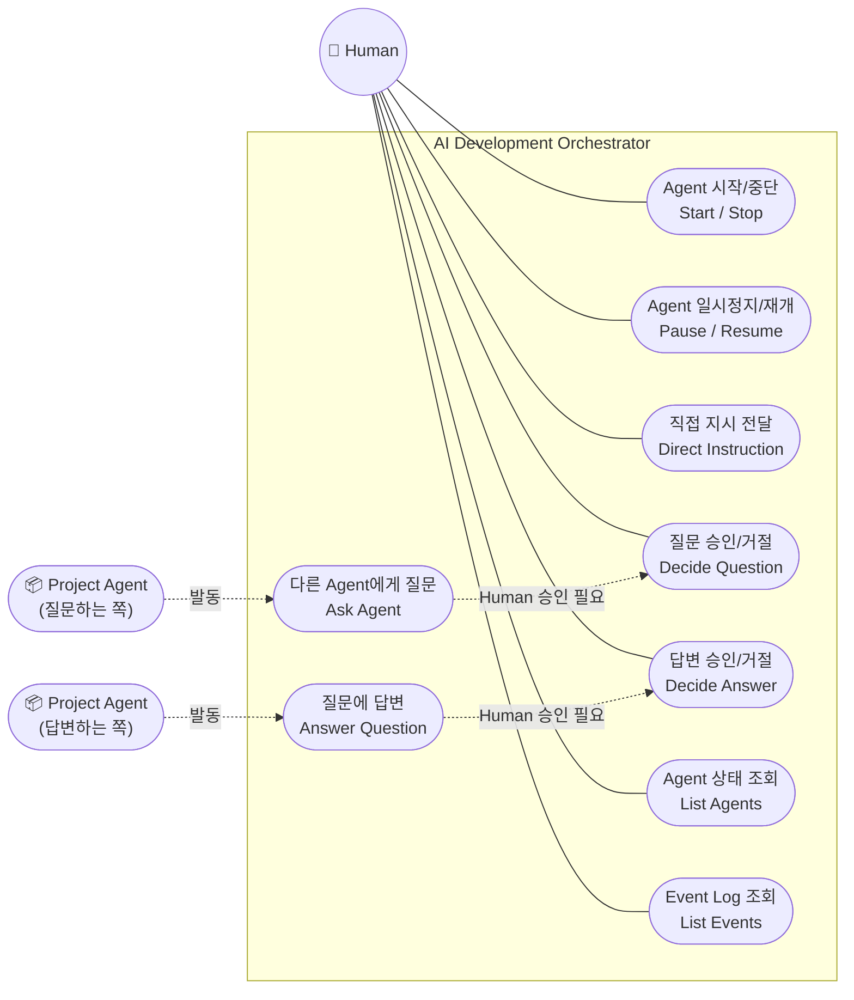
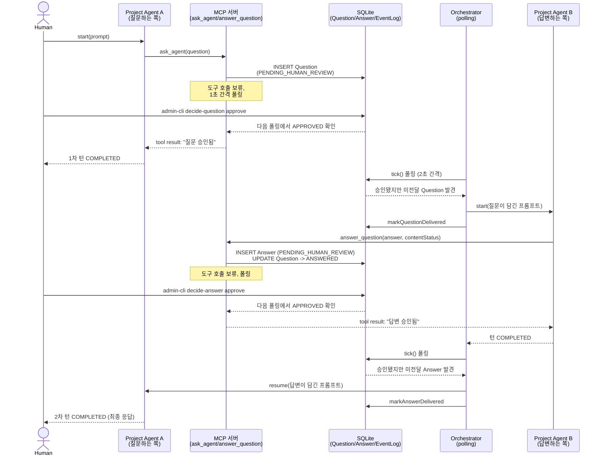
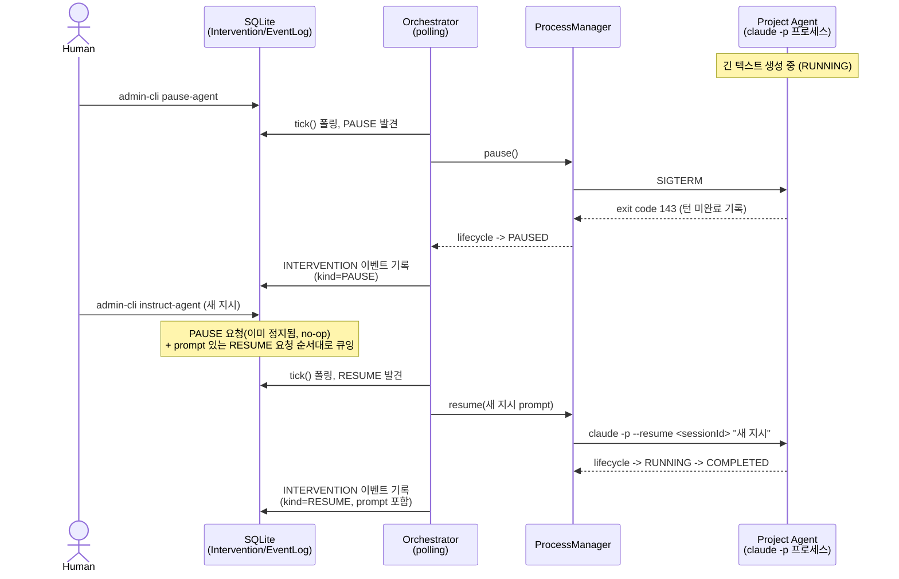

# 다이어그램

지금까지 구현·검증된 MVP 오케스트레이션 루프([architecture.md](architecture.md) §12, [mvp-scope.md](mvp-scope.md) 완료 기준 7개)를 유스케이스 다이어그램과 시퀀스 다이어그램으로 표현한다.

## 1. 유스케이스 다이어그램

Mermaid는 UML 유스케이스 다이어그램을 네이티브로 지원하지 않아, flowchart로 근사했다(액터는 사각형, 유스케이스는 스타디움 도형).

`admin-cli`가 Human 쪽 유스케이스(UC1~UC7)의 진입점이고, Project Agent는 MCP 도구(`ask_agent`/`answer_question`) 호출로 UC8/UC9를 스스로 발동시키지만 반드시 Human 승인(UC4/UC5)을 거쳐야 실제로 전달된다 — requirements.md §7~11의 "Agent 간 직접 통신 금지 + Human Review" 원칙이 유스케이스 구조 자체에 그대로 드러난다.

## 2. 시퀀스 다이어그램

### 2.1 Question → Answer 전체 왕복

[architecture.md §12.7](architecture.md#127-완료-기준-7개를-잇는-통합-테스트)의 통합 테스트(`manual-test-mvp-e2e.ts`)에서 실제로 검증된 흐름이다. `ask_agent`는 **답변이 아니라 질문이 승인되는 시점**에 바로 반환된다는 게 핵심이라, Agent A의 1차 턴은 Agent B가 답하기 한참 전에 이미 끝난다.

### 2.2 Human Intervention (Pause → Direct Instruction)

`admin-cli`는 "개입 요청"만 DB에 남기고, 실제 `SIGTERM`/`--resume` 호출은 살아있는 `ProcessManager`를 쥐고 있는 Orchestrator가 폴링하며 수행한다 — Question/Answer 승인과 동일한 요청/실행 분리 구조다.

두 시퀀스 다이어그램 모두 [architecture.md §12.4](architecture.md#124-processmanager--qa-storemcp-server-통합), [§12.6](architecture.md#126-human-intervention의-event-log-기록), [§12.7](architecture.md#127-완료-기준-7개를-잇는-통합-테스트)에서 실제 `claude -p` 세션으로 검증된 내용을 그대로 옮긴 것이다.
