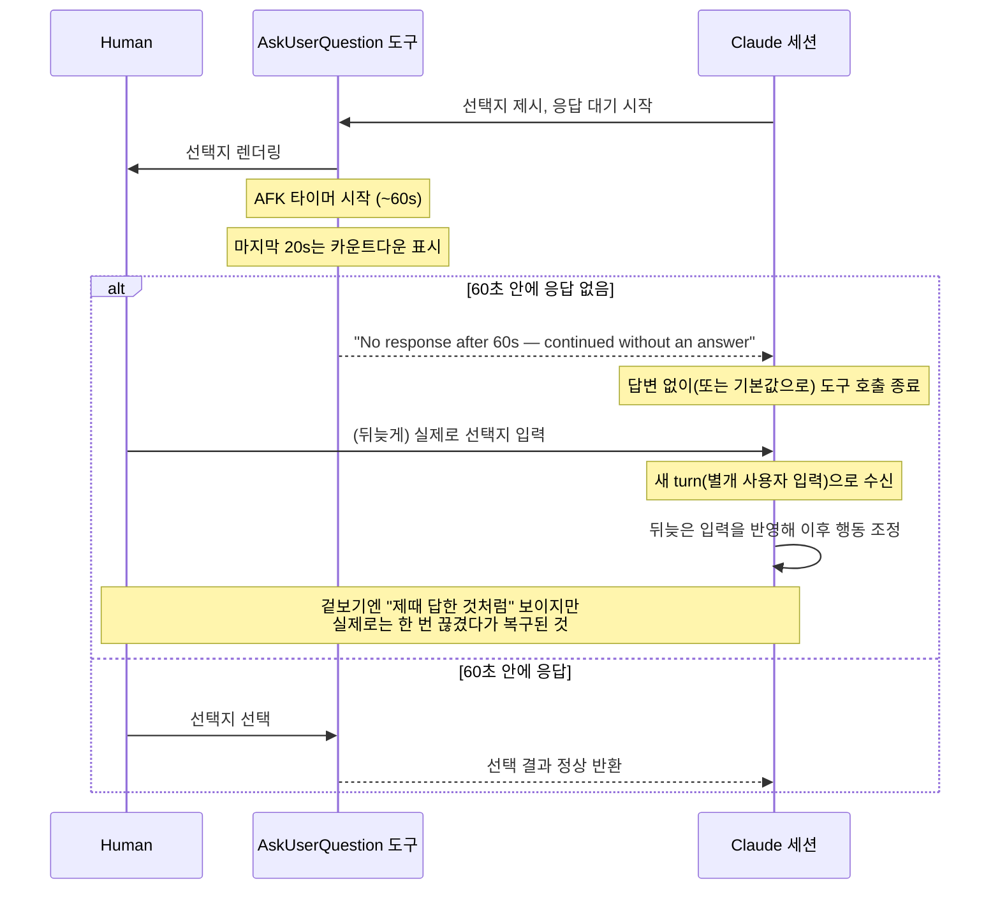
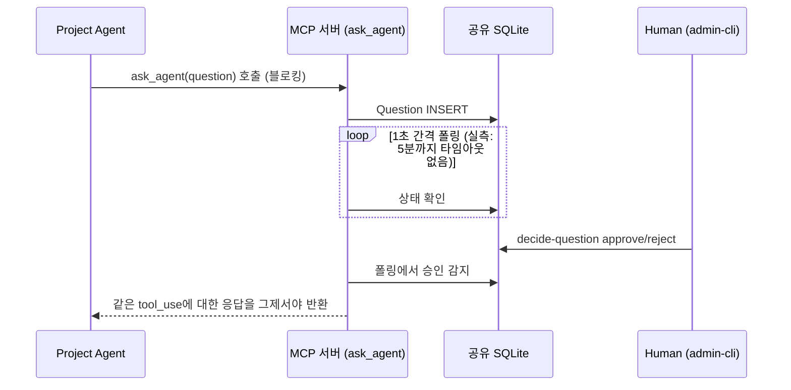

# 조사: 네이티브 `AskUserQuestion`의 60초 타임아웃 로그와 이 프로젝트의 승인 대기 방식 비교

## 배경

Claude Code 네이티브 멀티 에이전트 기능(`Agent` + `SendMessage`)을 실무에서 써보던 중 다음 현상이 관찰됐다: 특정 세션이 선택지를 제시하거나 확인을 요청한 뒤, 로그에 타임아웃 메시지가 찍힌다. 그런데 실제로는 그 뒤에 입력한 답변에 따라 별도 액션이 진행되는 것처럼 보인다 — "타임아웃 났다"는 로그와 "내 답변대로 동작한다"는 관찰이 서로 모순되는 것처럼 느껴졌다.

이 프로젝트가 [requirements.md §4.1](architecture.md#41-실측-검증-v21238-macos)에서 이미 "Human 승인을 얼마나 오래 보류할 수 있는가"를 실측하며 남겨둔 미해결 우려(§11: "장시간 미승인 상태는 별도의 안전장치를 고려하는 게 안전하다")와 정확히 같은 종류의 문제라, 원인을 확인하고 이 프로젝트의 설계와 대조해본다.

> **출처 주의**: 이 문서는 [comparison-native-multi-agent.md](comparison-native-multi-agent.md)와 마찬가지로 이 저장소의 다른 조사 문서(`investigation-mcp-session-delay.md` 등)와 달리 **직접 재현 실험을 하지 않았다**. Claude Code 공식 문서에 명시되지 않은 내부 동작이라, 웹 검색으로 확인된 GitHub 이슈·커뮤니티 분석 글에 근거했다. 정확한 두 타이머 값의 관계(아래 §1)는 출처에서도 명확히 특정되지 않아 추정으로 남겨둔다.

## 1. 원인: 하드코딩된 AFK(자리비움) 자동진행 타임아웃

네이티브 `AskUserQuestion` 도구에는 사람의 응답을 무한정 기다리지 않는 안전장치가 있다. 커뮤니티가 확인한 관련 환경변수는 다음 두 개다.

| 환경변수 | 기본값 | 역할(추정) |
|---|---|---|
| `CLAUDE_AFK_TIMEOUT_MS` | 60000 (60초) | 응답 대기 타이머 |
| `CLAUDE_AFK_COUNTDOWN_MS` | 20000 (20초) | 타임아웃 직전 카운트다운 표시 구간 |

시간 내 응답이 없으면 `"No response after 60s — continued without an answer"`가 로그에 남고, 도구 호출은 **답변 없이(또는 기본값으로) 종료**된다. 공식 설정 항목(`settings.json` 키, CLI 플래그)으로 끄거나 조정하는 방법은 없으며, v2.1.198 즈음 별도 공지 없이 도입된 것으로 보인다. 이 동작이 세이프티 게이트를 무력화하는 "동의 회귀(consent regression)"라는 지적이 여러 GitHub 이슈로 올라와 있다([#73435](https://github.com/anthropics/claude-code/issues/73435), [#30740](https://github.com/anthropics/claude-code/issues/30740), [#73105](https://github.com/anthropics/claude-code/issues/73105)). 실제로 타임아웃된 빈 응답이 "유효한 선택"으로 취급되어 160개 항목이 사용자 동의 없이 자동 처리된 사례도 보고됐다([ReasonCore 분석](https://reasoncore.dev/post/claude-codes-60s-askuserquestion-auto-continue-and-why-it-broke-interactive-safety)).

## 2. 왜 "타임아웃 났는데 내 답변대로 동작하는" 것처럼 보이는가

타임아웃이 발동해도 사용자가 직후에 입력한 텍스트 자체가 사라지는 건 아니다. 그 입력은 **원래 질문에 대한 답변이 아니라, 별개의 새 turn**으로 세션에 들어가고, Claude가 그걸 보고 이후 행동을 조정한다. 즉 "제때 답변을 받아서 그에 따라 행동한 것"이 아니라 "한 번 포기했다가, 뒤늦게 도착한 지시를 다시 반영한 것"이다. 겉보기 결과가 비슷해서 구분이 잘 안 될 뿐, 내부적으로는 다른 경로다.

## 3. 이 프로젝트의 승인 대기 방식과 대조

이 프로젝트의 `ask_agent`/`answer_question`은 네이티브 `AskUserQuestion`과 코드 경로 자체가 다르다. Human 승인은 UI 프롬프트가 아니라 별도 프로세스(`admin-cli`)가 공유 SQLite를 갱신하는 방식이고, MCP 서버는 그 상태를 폴링하며 도구 호출 자체를 계속 열어둔다.

**핵심 차이**: 네이티브는 "일정 시간 후 자동으로 포기하고, 뒤늦은 입력은 별도 채널(새 turn)로 복구"하는 2단계 구조인 반면, 이 프로젝트는 "승인이 날 때까지 같은 도구 호출 하나가 계속 열려 있는" 단일 채널 구조다. 이 프로젝트 쪽은 [architecture.md §4.1](architecture.md#41-실측-검증-v21238-macos)에서 최소 5분까지 이 방식이 안전함을 실측으로 확인했다.

## 4. 이 프로젝트에도 재현될 위험이 있는가

구조가 다르므로 **네이티브와 동일한 형태(60초 AFK)로는 재현되지 않을 것**으로 판단한다. 다만 이 프로젝트는 아직 실무에서 사용된 적이 없고, 다음 두 가지는 검증되지 않은 채 남아 있다.

- **5분보다 훨씬 긴 보류**(수 시간 단위)에서도 `claude -p` 프로세스나 MCP stdio 연결 자체에 별도의 상한이 없는지. §4.1은 5분까지만 확인했다.
- **완전한 AFK 상황**(터미널 포커스 없음, 키 입력 전혀 없음)을 재현했을 때도 동일하게 안전한지. 지금까지의 실측은 전부 스크립트나 사람이 몇 분 안에 승인하는 시나리오였다.

네이티브 쪽 사례가 "사람이 지켜보지 않는 상태를 오래 방치하면 어딘가에서 안전장치가 조용히 발동할 수 있다"는 걸 실제로 보여준 만큼, 실무 투입 전에 이 두 조건(장시간 + AFK)을 조합해 재현 실험을 해보는 걸 권한다. 재현 방법은 `investigation-mcp-session-delay.md`가 쓴 것과 같은 접근(임시 디렉터리, 세션 소모 최소화, 단계적 격리)을 그대로 따르면 된다.

## 결론

로그에 찍힌 타임아웃은 실재하는 동작(`CLAUDE_AFK_TIMEOUT_MS` 60초 자동진행)이었고, "내 답변대로 동작하는 것처럼 보인 것"은 타임아웃 이후 도착한 입력이 별도 turn으로 재반영된 결과였다. 이 프로젝트의 승인 대기 방식은 같은 하드코딩된 60초 제한을 공유하지 않지만, "장시간·무관찰 보류"라는 더 넓은 범주의 위험은 아직 이 프로젝트에서도 완전히 배제되지 않았다.
